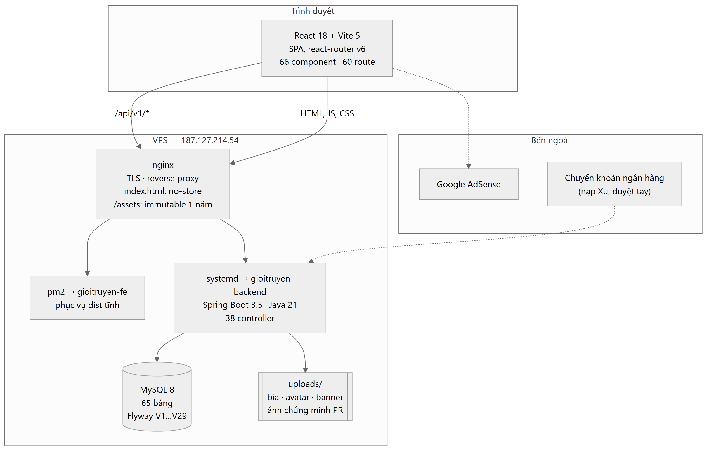
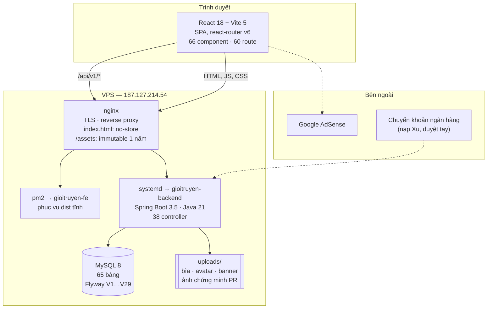
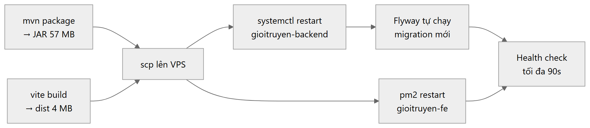
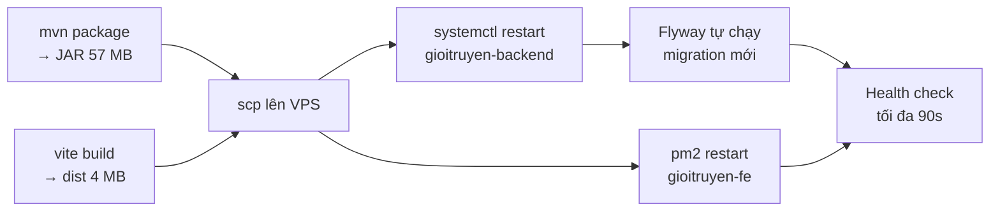
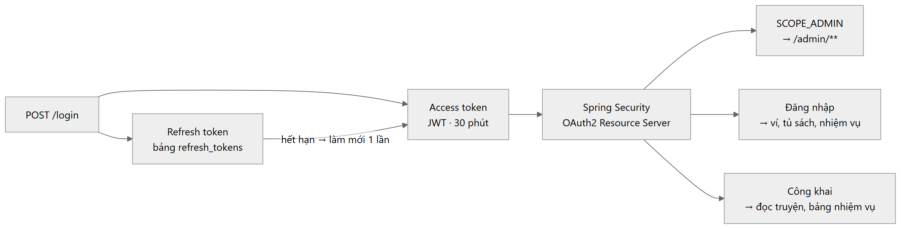
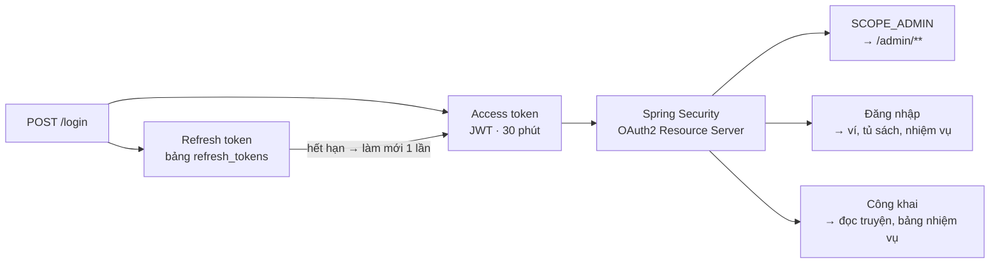

# Kiến trúc Giới Truyện

Tài liệu mô tả hệ thống **như nó đang chạy**, không phải như dự định. Mọi con số và
tên bảng trong đây đều lấy từ mã nguồn và cơ sở dữ liệu thật.

| Tài liệu | Nội dung |
|---|---|
| [modules.md](modules.md) | Bản đồ 16 module backend, cấu trúc frontend, luật phụ thuộc |
| [entities.md](entities.md) | Sơ đồ thực thể, 65 bảng chia theo miền nghiệp vụ |
| [flows.md](flows.md) | Sơ đồ tuần tự cho các luồng quan trọng |

Đặc tả tính năng nằm ở [../featured/](../featured/).

---

## 1. Tổng quan

Giới Truyện là nền tảng đọc truyện chữ và truyện audio tiếng Việt. Ba nhóm người dùng:

- **Độc giả** — đọc miễn phí, mua chương trả phí bằng Xu, nhận nhiệm vụ
- **Nhóm xuất bản** — đăng truyện, đặt giá chương, chạy chiến dịch quảng bá
- **Quản trị viên** — duyệt nội dung, xử lý nạp/rút, phân xử tranh chấp

Mã nguồn sơ đồ

### Vì sao là SPA chứ không phải SSR

Toàn bộ nội dung render phía client. Điều này có một hệ quả thật cần biết:
**crawler chỉ thấy vỏ HTML rỗng**, không thấy nội dung truyện. Ảnh hưởng cả SEO lẫn
việc AdSense chọn quảng cáo theo ngữ cảnh. Đây là giới hạn kiến trúc đã biết, sửa được
bằng prerender hoặc SSR cho route truyện và chương — chưa làm.

---

## 2. Triển khai

Một script duy nhất: `upload_vps.ps1`.

Mã nguồn sơ đồ

Migration nằm sẵn trong JAR (`classpath:db/migration`), Flyway chạy khi backend khởi động.
Script chỉ upload thêm bản `.sql` rời để đối chiếu tay.

**Ràng buộc đã biết**: SSH/SCP tới VPS chỉ xác thực được từ PowerShell, không từ Bash.

---

## 3. Những quyết định định hình hệ thống

| Quyết định | Lý do |
|---|---|
| Ví Xu là ví **người dùng**, không phải ví nhóm | Thu nhập nhóm ghi vào ví chủ nhóm; `team_ledger` chỉ là sổ đối chiếu |
| Mọi thao tác tiền dùng `FOR UPDATE` | Hai giao dịch đồng thời không được rút quá số dư |
| Chiếm suất/slot bằng **một câu UPDATE có điều kiện** | Không có khe hở giữa đọc và ghi — xem [flows.md](flows.md) |
| `chapters.content` là `MEDIUMTEXT` | `TEXT` là 65.535 **byte**; tiếng Việt ~3 byte/ký tự → trần ~21.800 ký tự |
| `index.html` gửi `no-store` | SPA không có cache header sẽ bị trình duyệt cache theo heuristic |
| Route không khai báo trong Security rơi vào `denyAll` | Trả **403**, không phải 404 — dễ hiểu nhầm là lỗi quyền |

---

## 4. Xác thực và phân quyền

Mã nguồn sơ đồ

`users.role` chỉ phân biệt `READER` và `ADMIN`. Quyền xuất bản **không** nằm ở đó — nó
đến từ một dòng `team_members` đang `ACTIVE` với vai trò `OWNER` / `MANAGER` / `EDITOR` /
`MEMBER`. Tiêu tiền của nhóm chỉ `OWNER` và `MANAGER` được phép.
