# Sơ đồ thực thể

65 bảng. Vẽ tất cả vào một sơ đồ thì không ai đọc được, nên chia theo miền nghiệp vụ —
đúng theo cách các module backend chia.

Chỉ vẽ cột khoá và cột mang ý nghĩa nghiệp vụ; cột `created_at` / `updated_at` có ở hầu
hết bảng nên bỏ qua cho gọn.

---

## 1. Nội dung

Xương sống của cả nền tảng.

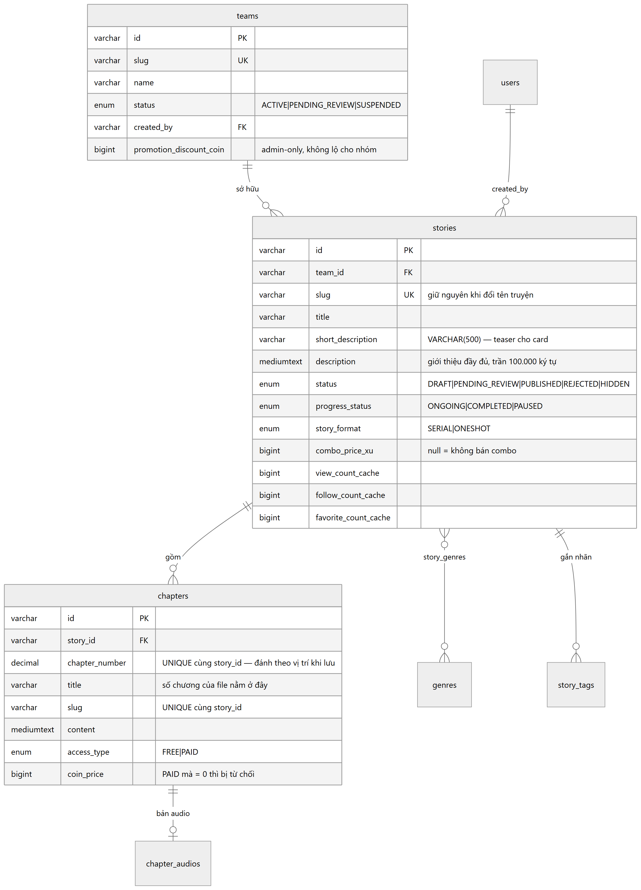

Mã nguồn sơ đồ

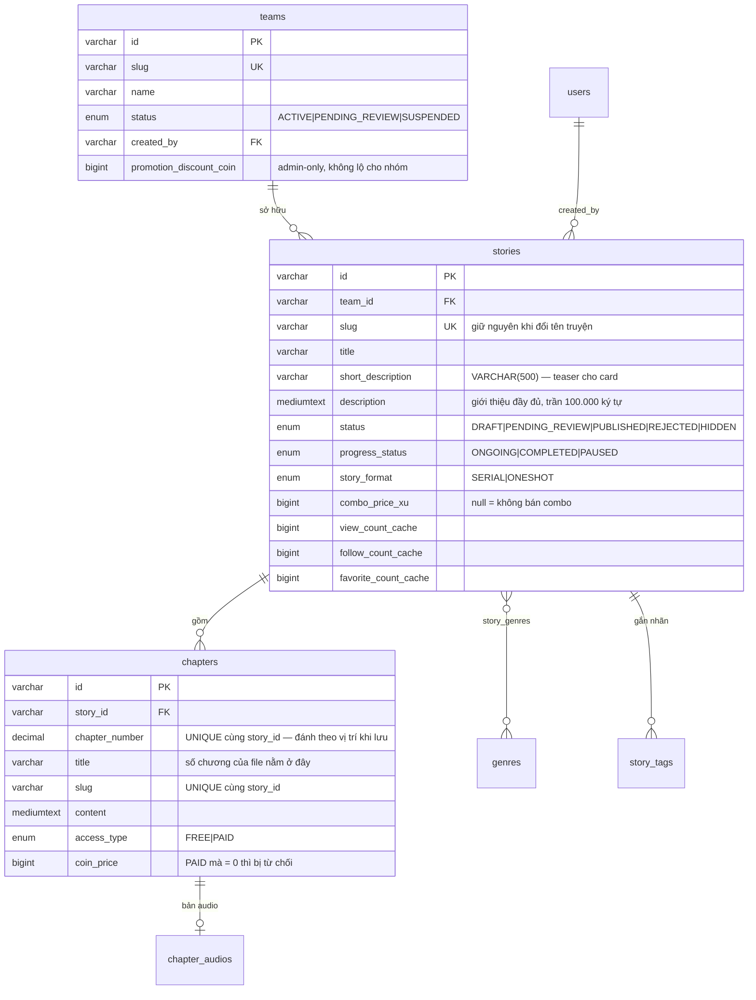

> **Điểm dễ nhầm.** `chapters.chapter_number` được đánh lại **theo vị trí** mỗi lần lưu,
> nên luôn là 1…N liền mạch. Số chương mà file gốc ghi nằm trong `title`. Truyện nhập từ
> file thiếu chương 87 sẽ có 385 dòng đánh số 1–385, nhưng tiêu đề chạy tới "Chương 386".
> Cảnh báo thiếu chương phải đọc từ **title**, không đọc từ `chapter_number`.

---

## 2. Đọc và tương tác

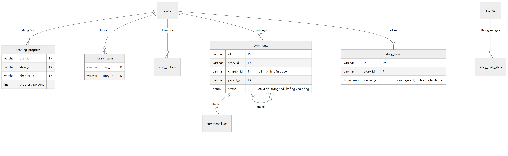

Mã nguồn sơ đồ

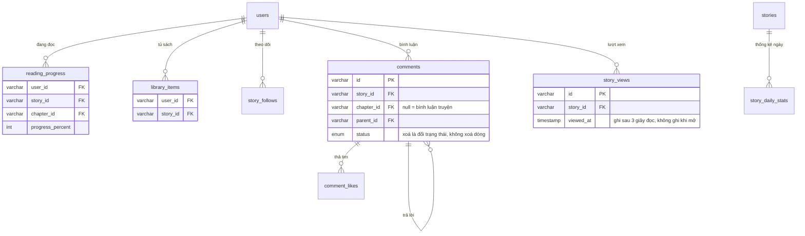

Bình luận bị xoá **giữ nguyên dòng** và đổi `status`. Một chuỗi trả lời bị thủng ở giữa
thì đọc như hỏng, và kiểm duyệt cần thấy nội dung đã nói gì.

---

## 3. Tiền

Miền phức tạp nhất, và là nơi một lỗi nhỏ thành mất tiền thật.

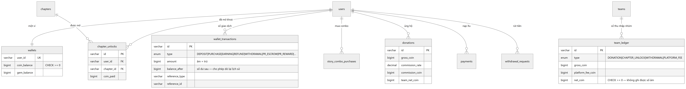

Mã nguồn sơ đồ

```mermaid
erDiagram
    users ||--|| wallets : "một ví"
    users ||--o{ wallet_transactions : "sổ giao dịch"
    users ||--o{ chapter_unlocks : "đã mở khoá"
    users ||--o{ story_combo_purchases : "mua combo"
    users ||--o{ donations : "ủng hộ"
    users ||--o{ payments : "nạp Xu"
    users ||--o{ withdrawal_requests : "rút tiền"
    teams ||--o{ team_ledger : "sổ thu nhập nhóm"
    chapters ||--o{ chapter_unlocks : "được mở"

    wallets {
        varchar user_id UK
        bigint coin_balance "CHECK >= 0"
        bigint gem_balance
    }
    wallet_transactions {
        varchar id PK
        enum type "DEPOSIT|PURCHASE|EARNING|REFUND|WITHDRAWAL|PR_ESCROW|PR_REWARD|…"
        bigint amount "âm = trừ"
        bigint balance_after "số dư sau — cho phép dò lại lịch sử"
        varchar reference_type
        varchar reference_id
    }
    chapter_unlocks {
        varchar id PK
        varchar user_id FK
        varchar chapter_id FK
        bigint coin_paid
    }
    donations {
        varchar id PK
        bigint gross_coin
        decimal commission_rate
        bigint commission_coin
        bigint team_net_coin
    }
    team_ledger {
        varchar id PK
        enum type "DONATION|CHAPTER_UNLOCK|WITHDRAWAL|PLATFORM_FEE"
        bigint gross_coin
        bigint platform_fee_coin
        bigint net_coin "CHECK >= 0 — không ghi được số âm"
    }
```

Ba điều cần nhớ:

1. **Không có ví nhóm.** Thu nhập của nhóm vào ví của chủ nhóm. `team_ledger` là sổ đối
   chiếu, không phải nơi giữ tiền.
2. `wallet_transactions.balance_after` cho phép dựng lại số dư tại bất kỳ thời điểm nào —
   nếu số dư lệch, đây là chỗ tìm ra lệch từ đâu.
3. `team_ledger.net_coin` có `CHECK >= 0`, nên **không ghi được khoản chi**. Chi tiêu của
   nhóm (bố cáo, chiến dịch PR) chỉ để lại dấu ở `wallet_transactions`.

---

## 4. Quảng bá

Hai cơ chế khác hẳn nhau, thường bị nhầm là một.

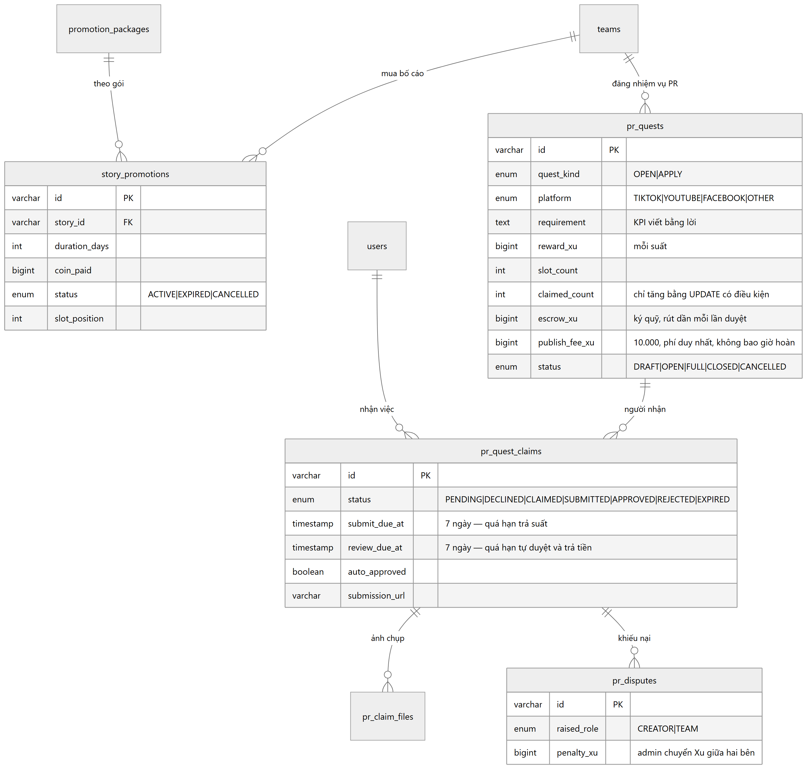

Mã nguồn sơ đồ

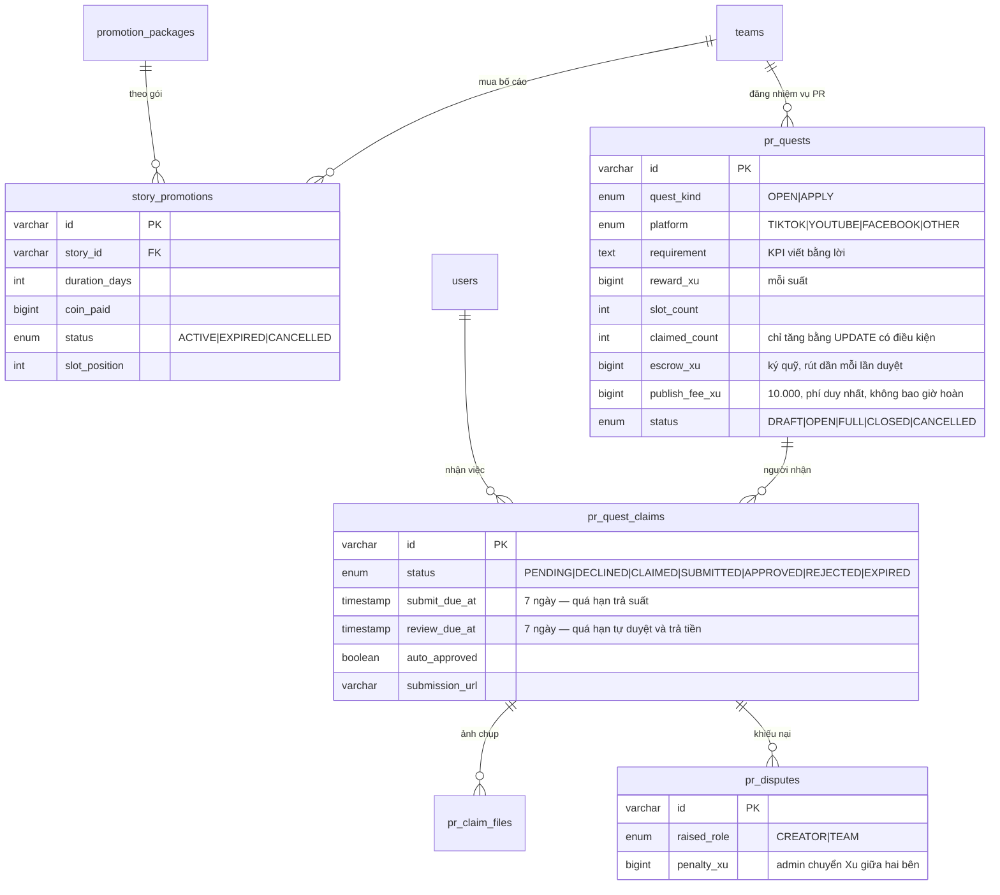

| | Bố cáo | Chiến dịch PR |
|---|---|---|
| Mua cái gì | **Vị trí** hiển thị trên trang chủ | **Kết quả** — người thật làm nội dung |
| Diễn ra ở đâu | Trên web | Ngoài web: TikTok, YouTube, Facebook |
| Trả tiền cho ai | Nền tảng | Độc giả làm nội dung |
| Kiểm chứng | Tự động, theo ngày | Người duyệt |

`UNIQUE (quest_id, user_id)` trên `pr_quest_claims` là thứ khiến một người không thể
nhận hai lần, kể cả khi bấm hai tab cùng lúc.

---

## 5. Nhiệm vụ và game hoá

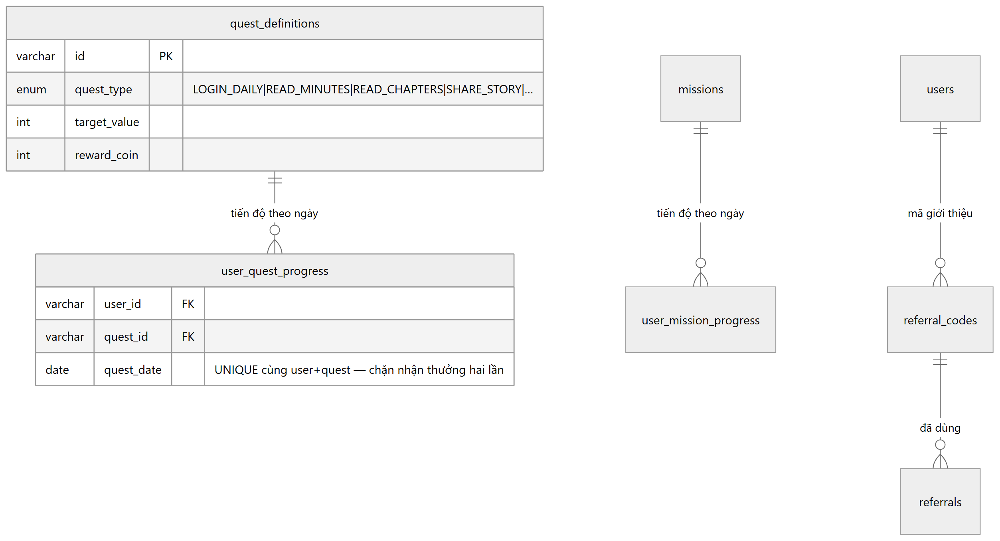

Mã nguồn sơ đồ

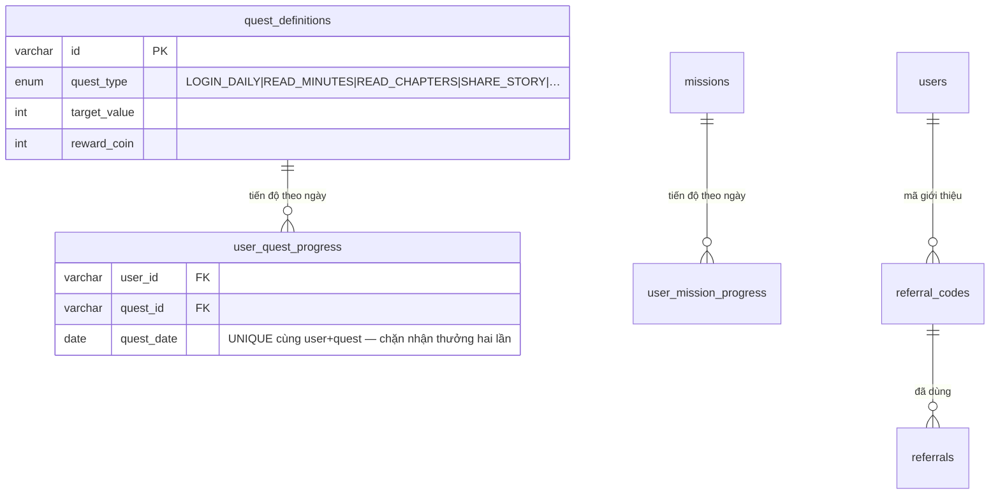

`quest_definitions` là nhiệm vụ **lặp mỗi ngày**, có `daily_limit`. Chiến dịch PR thì
gắn một truyện, có ngân sách, mỗi người làm một lần — nên dùng bảng riêng chứ không ghép
vào đây. Ghép vào sẽ làm hỏng ý nghĩa của nhiệm vụ ngày.

---

## 6. Hệ thống và kiểm duyệt

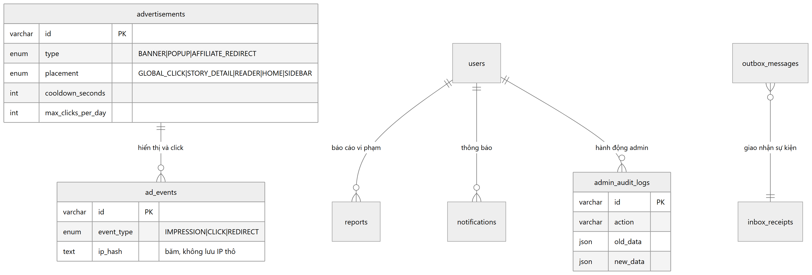

Mã nguồn sơ đồ

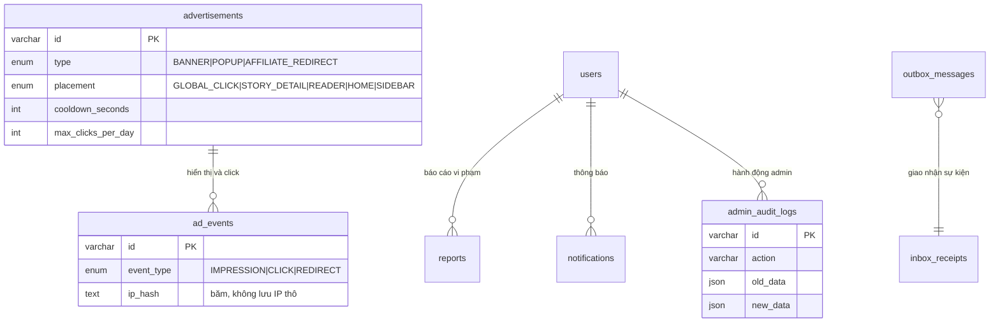

`ad_events` chỉ ghi banner **của hệ thống**. Số liệu AdSense không nằm trong CSDL này —
chúng ở tài khoản AdSense và cần AdSense Management API mới đọc được.
