# Luồng nghiệp vụ

Bốn luồng quan trọng nhất, và với mỗi luồng là chỗ nó **từng hỏng**.

---

## 1. Mở khoá chương trả phí

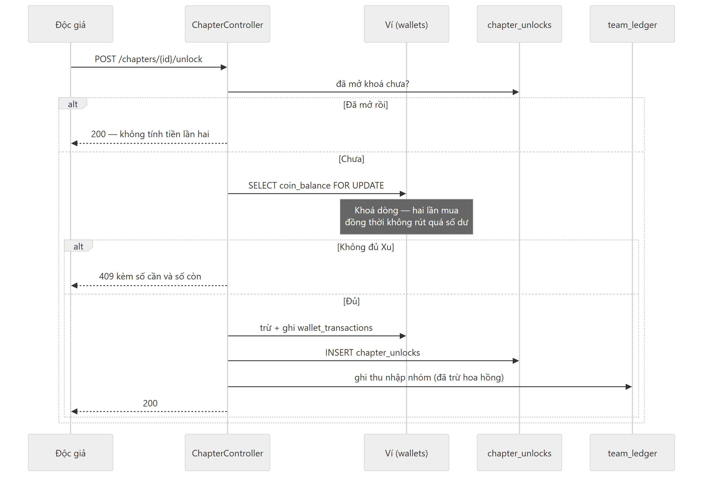

<details><summary>Mã nguồn sơ đồ</summary>

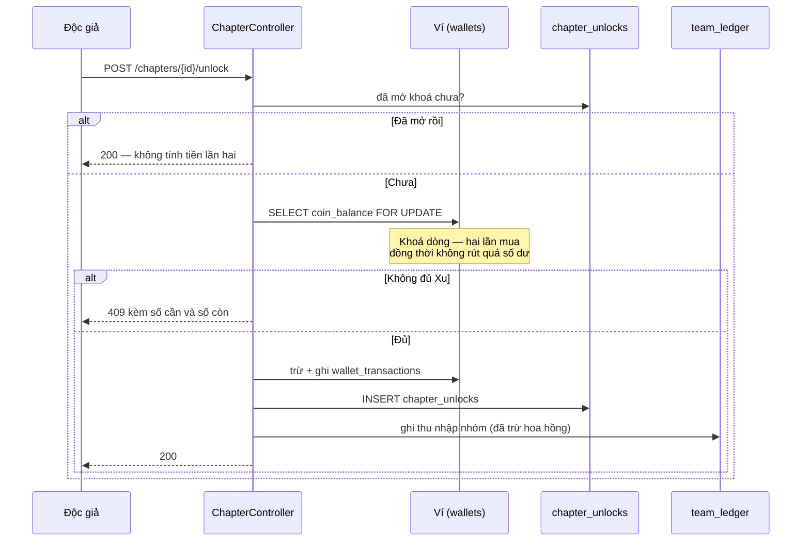

</details>

Toàn bộ nằm trong một transaction. `FOR UPDATE` là thứ khiến hai tab mua cùng lúc không
tiêu quá số dư.

---

## 2. Đăng truyện từ file

Luồng phức tạp nhất phía client, và là nơi mất chữ dễ xảy ra nhất.

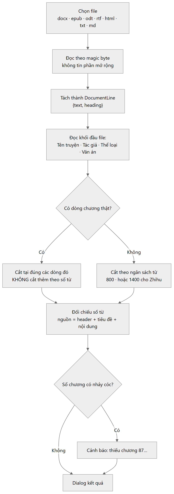

<details><summary>Mã nguồn sơ đồ</summary>

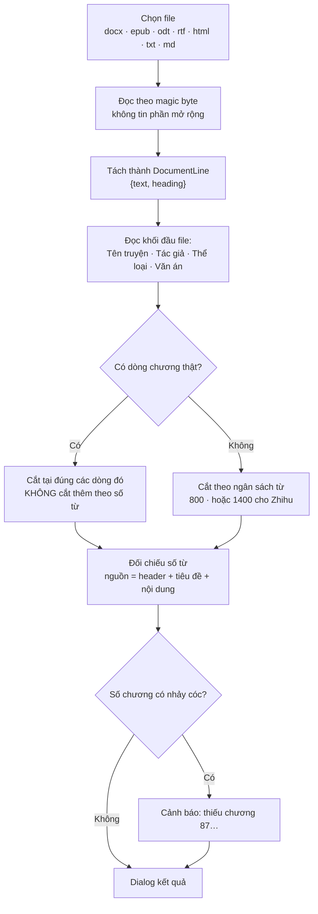

</details>

### Ba cái bẫy đã cắn thật

| Triệu chứng | Nguyên nhân |
|---|---|
| 83 chương thay vì 72 | Dòng ngày `17.3.2015.` khớp luật "chương là số trần" |
| Hai chương 48.000 từ, MySQL từ chối | Một dòng `1` lạc và một dòng danh sách `3. Mua cùng…` bị đọc thành tiêu đề chương |
| File 101 chương thành **một** chương 78.310 từ | "Thêm file" đọc cả file thành một chương, không nhìn dòng phân chương bên trong |

Cái thứ ba đáng nhớ nhất: một file bổ sung như `Up-2 108-208.docx` **là 101 chương**,
không phải một chương. Nay dòng phân chương của chính file quyết định — nhiều dòng thì
nhiều chương, không dòng nào thì file đó thật sự là một chương và giữ nguyên toàn bộ.

### Lưu chương: đối chiếu theo id, không theo vị trí

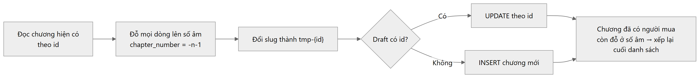

<details><summary>Mã nguồn sơ đồ</summary>

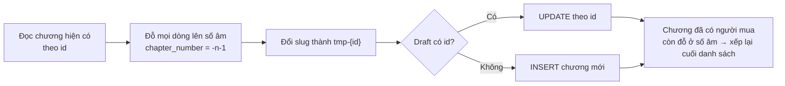

</details>

Việc "đỗ lên số âm" là bắt buộc: `UNIQUE (story_id, chapter_number)` sẽ đụng nhau giữa
chừng nếu đánh số lại tại chỗ. Bản cũ xoá rồi chèn lại theo **vị trí**, nên chèn một
chương vào giữa là ghi đè nhầm chương và độc giả mất chương đã mua.

---

## 3. Chiến dịch PR — vòng đời

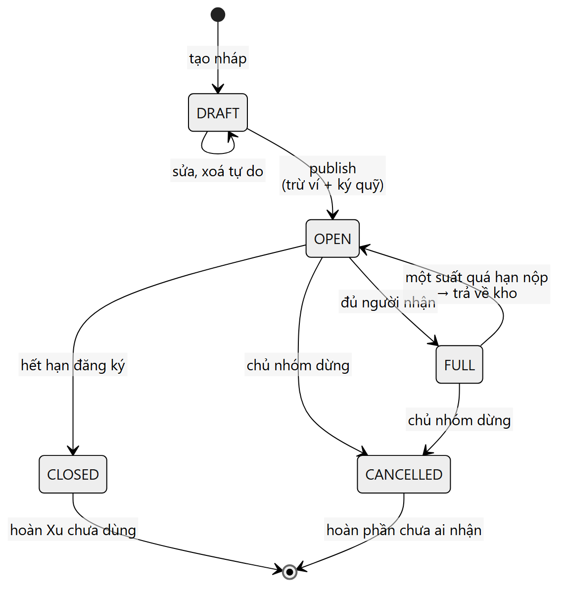

<details><summary>Mã nguồn sơ đồ</summary>

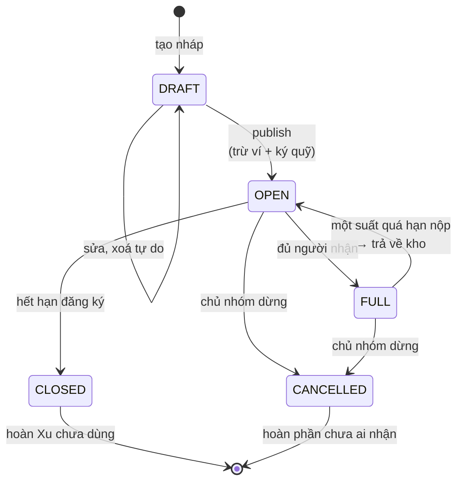

</details>

Trạng thái của một suất:

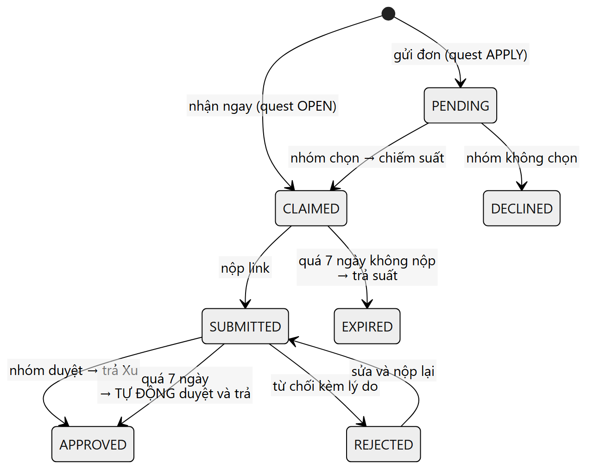

<details><summary>Mã nguồn sơ đồ</summary>

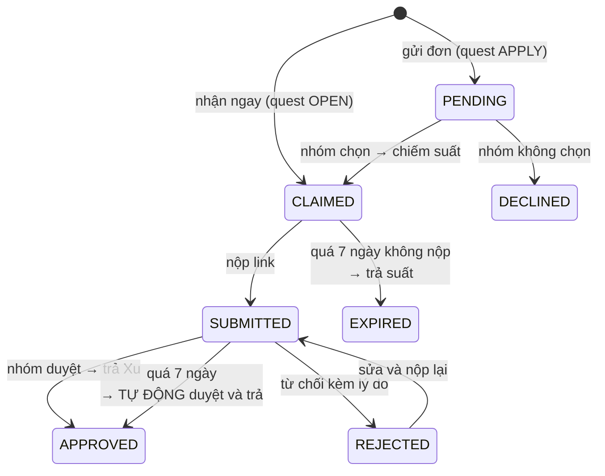

</details>

### Chiếm suất khi nhiều người bấm cùng lúc

Cách **sai** — có khe hở giữa đọc và ghi:

```sql
SELECT claimed_count FROM pr_quests WHERE id = ?;   -- cả hai đọc thấy 4/5
INSERT INTO pr_quest_claims ...                     -- cả hai cùng ghi → 6/5
```

Cách **đúng** — mọi điều kiện nằm trong `WHERE`, một câu, tự nguyên tử:

```sql
UPDATE pr_quests
   SET claimed_count = claimed_count + 1
 WHERE id = :questId
   AND status = 'OPEN'
   AND claimed_count < slot_count
   AND registration_ends_at > NOW(3);
```

`1` dòng = giành được suất. `0` = hết suất hoặc quá hạn. MySQL khoá dòng trong lúc UPDATE
nên hai request buộc xếp hàng — không cần khoá thủ công, không cần hàng đợi.

Thêm lớp thứ hai: `UNIQUE (quest_id, user_id)`.

### Và thứ tự hai câu đó cũng quan trọng

Test tích hợp phát hiện: **INSERT phải chạy trước UPDATE**.

Đặt `takeSlot()` trước có nghĩa là cú bấm trùng — thứ mà `UNIQUE` rồi sẽ chặn — **đã tiêu
mất một suất**. Transaction rollback cứu được, nhưng chỉ vì exception thoát ra ngoài; ai
đó về sau bắt và nuốt nó là suất bay âm thầm. Đảo lại thì cú bấm trùng không thể bị tính
tiền, bất kể chuyện gì xảy ra sau đó.

### Tiền chảy đi đâu

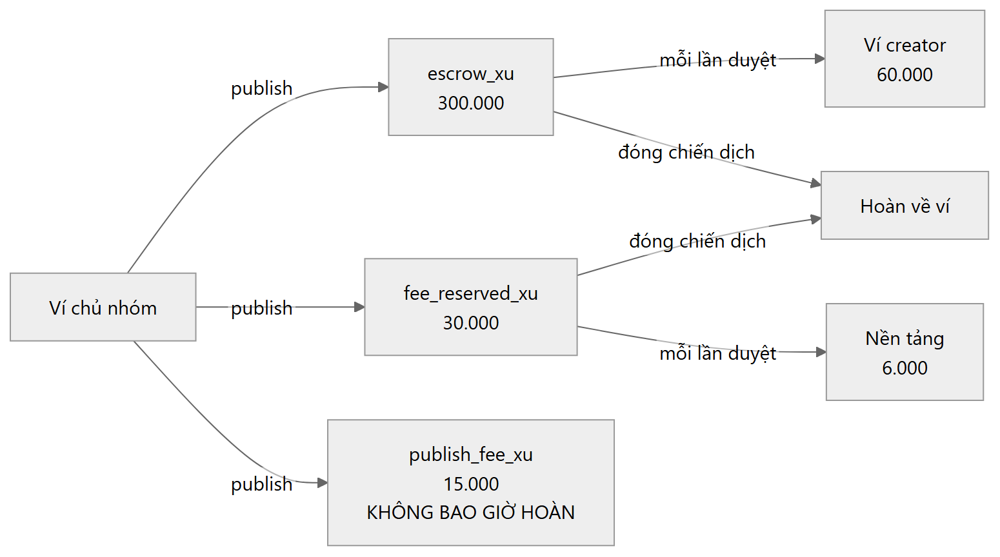

<details><summary>Mã nguồn sơ đồ</summary>

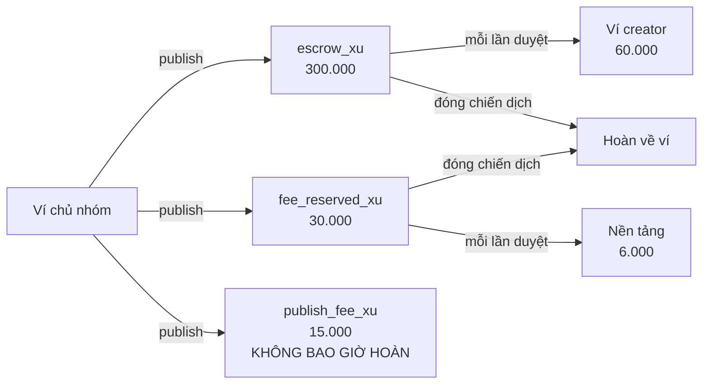

</details>

Với 5 suất, chỉ 1 người được duyệt: trừ **345.000**, trả creator **60.000**, nền tảng giữ
**15.000 + 6.000**, hoàn lại **264.000**. Đã kiểm chứng bằng test chạy tiền thật trong
CSDL.

Phí publish không hoàn là thứ khiến việc "tự thuê tài khoản phụ của mình" mất tiền chứ
không được lợi.

---

## 4. Việc chạy theo giờ

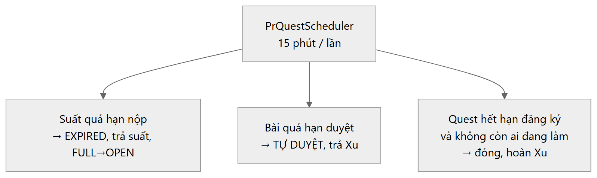

<details><summary>Mã nguồn sơ đồ</summary>

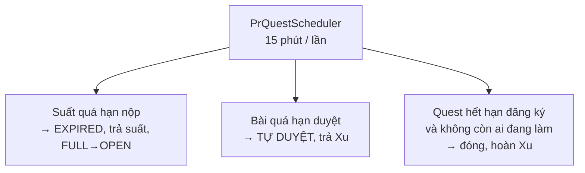

</details>

Không có lớp này thì mọi thời hạn chỉ là chữ trên màn hình. Chúng không thể chạy theo
request được — **người đang câu giờ chính là người không gửi request nào**.

Lỗi được nuốt và ghi log: lần chạy sau nhặt lại việc lần này bỏ sót, còn để exception
thoát ra chỉ khiến scheduler ngừng thử lại.
