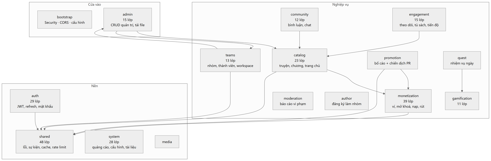
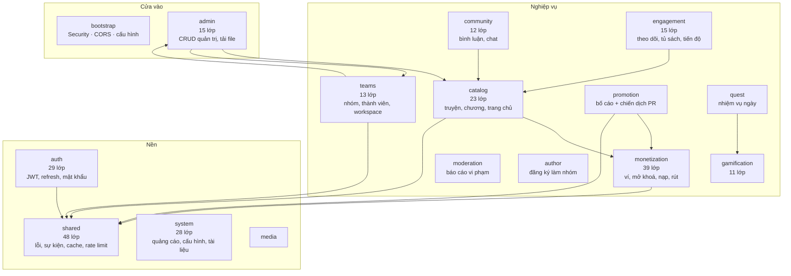
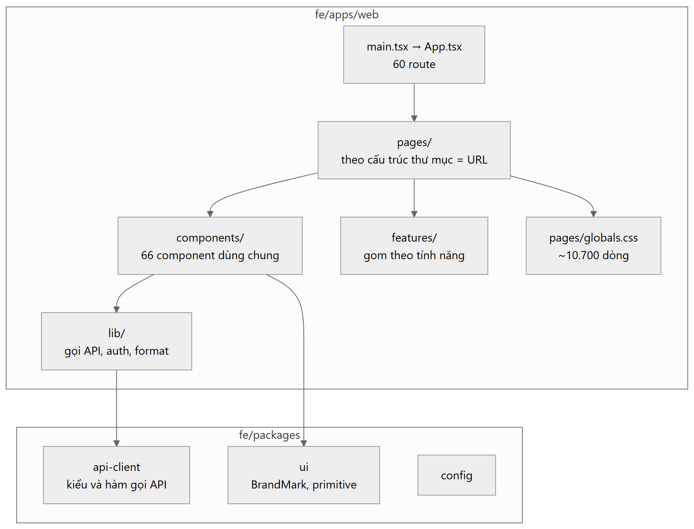
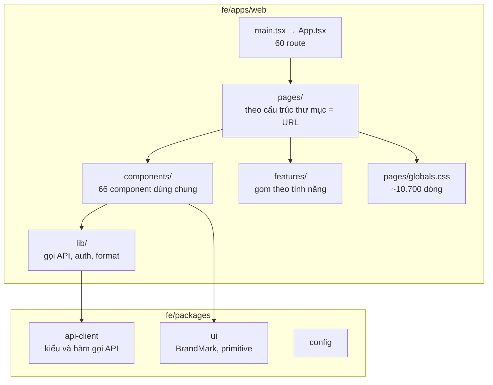
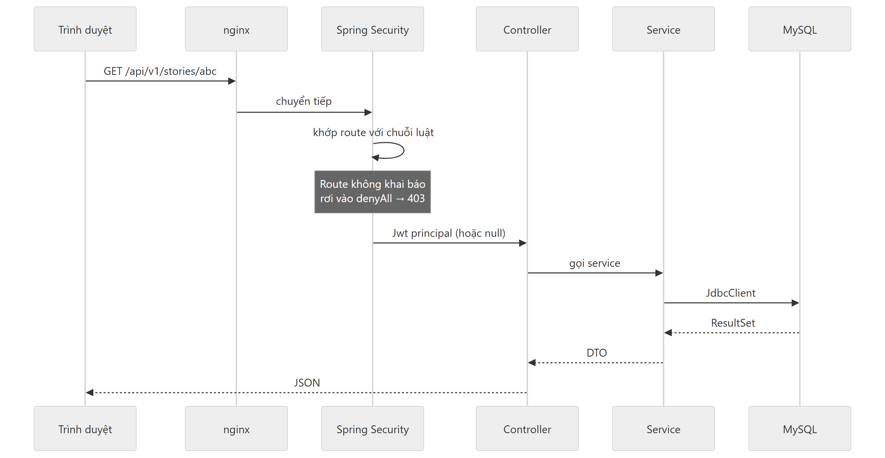
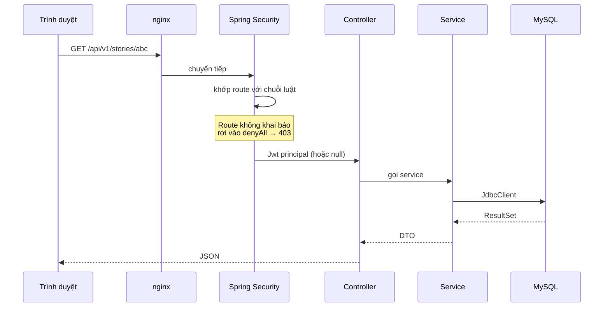

# Bản đồ module

## Backend — 16 module

Monolith module hoá. Mỗi module là một package dưới `com.storyplatform`, có ranh giới
riêng, và ArchUnit giữ cho ranh giới đó không bị vượt.



<details><summary>Mã nguồn sơ đồ</summary>



</details>

### Một phụ thuộc ngược cố ý

`teams` gọi vào `admin` — cụ thể là `TeamWorkspaceController` dùng lại
`AdminStoryController` để ghi truyện.

Nhìn thì ngược đời, nhưng lý do vững: **tạo truyện là cùng một việc dù ai yêu cầu**.
Luật slug, bảng liên kết thể loại và nhãn, đánh số chương, kiểm tra chương trả phí phải
có giá, và chốt chặn không cho mất chương — tất cả phải hành xử giống hệt nhau, và
khoảng 400 dòng logic. Nhân đôi sẽ thành hai bản trôi dạt khỏi nhau, mà bản của nhóm xuất
bản mới là bản không ai để ý là đã sai.

Cái mà `TeamWorkspaceController` thêm vào là **phân quyền**: chứng minh người gọi được
phép thay mặt nhóm, ghim `teamId` về đúng nhóm đó, và từ chối động vào truyện của nhóm
khác.

### Cấu trúc bên trong một module

```
com.storyplatform.<module>/
├── api/               ← @RestController, DTO request/response
├── application/       ← service, logic nghiệp vụ, dto/
├── domain/            ← entity, enum
└── infrastructure/    ← repository
```

Không phải module nào cũng có đủ bốn tầng. `promotion` chẳng hạn chỉ có `api/` và
`application/` — nó thao tác bằng `JdbcClient` chứ không ánh xạ entity.

### JdbcClient hay Repository

Cả hai đều dùng, có chủ đích:

- **Spring Data JDBC repository** cho thực thể đơn giản, đọc/ghi cả cục
- **`JdbcClient` thẳng** cho truy vấn phức tạp, cập nhật có điều kiện, và mọi chỗ động
  tới tiền

Có một cái bẫy đã cắn một lần: `repository.save()` với `@Id` đã gán giá trị sẽ phát
**UPDATE**, không phải INSERT. Chuyện này làm mọi lượt ghi `ad_events` trả 500 với lỗi
`Id ... not found in database`. Sinh id ở tầng ứng dụng thì phải INSERT tường minh.

---

## Frontend



<details><summary>Mã nguồn sơ đồ</summary>



</details>

### CSS: một file toàn cục và vài CSS Module

Phần lớn kiểu dáng nằm trong `pages/globals.css` (~10.700 dòng), một số component có
`.module.css` riêng.

Cách này đã sinh ra **một lớp lỗi lặp đi lặp lại**, đáng ghi lại để không mắc nữa:

```css
.catalogCardBody h3 a          { color: #0f172a !important; }  /* thắng */
[data-theme="dark"] … h3 a     { color: #f8fafc; }             /* thua */
```

Rule dark có specificity cao hơn, **nhưng `!important` thắng bất kể specificity**. Tên
truyện vì thế luôn đen, kể cả ở theme tối. Cách sửa không phải là thêm `!important` vào
rule dark, mà là **dùng token**: `var(--text-primary)` tự đổi theo theme, và cả lớp lỗi
biến mất.

Luật rút ra: **màu không bao giờ được định nghĩa duy nhất bên trong một khối
`@media` hay `[data-theme]`.** Định nghĩa ở token trên `:root`, rồi mới đổi giá trị token.

### Route được sinh từ cấu trúc thư mục

`pages/teams/[teamId]/pr/page.tsx` → `/teams/:teamId/pr`

Nhưng `App.tsx` phải khai báo route **thủ công**. Tạo file mà quên khai báo thì route
không tồn tại, không có lỗi nào báo.

---

## Đường đi của một request



<details><summary>Mã nguồn sơ đồ</summary>



</details>

Chỗ hay bẫy: **một route không khai báo trong `SecurityConfiguration` sẽ trả 403**, đọc
như lỗi phân quyền trong khi thật ra là quên khai báo. Đã cắn ở `/stories/*/combo-purchase`
và `/teams/*/published-stories`.
