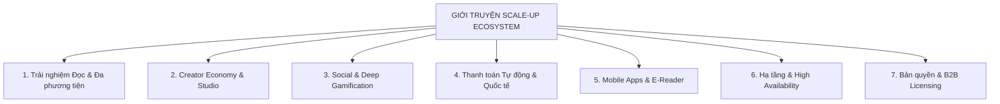
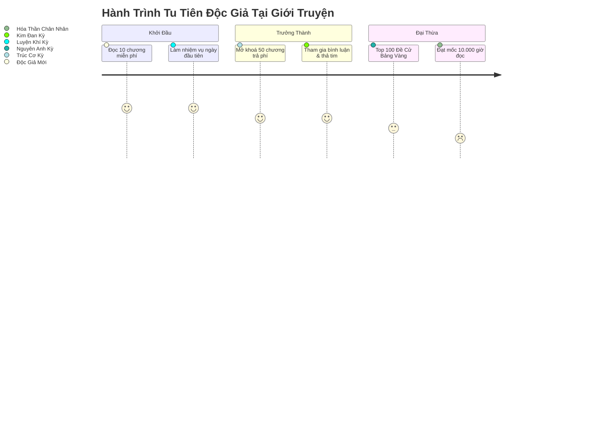
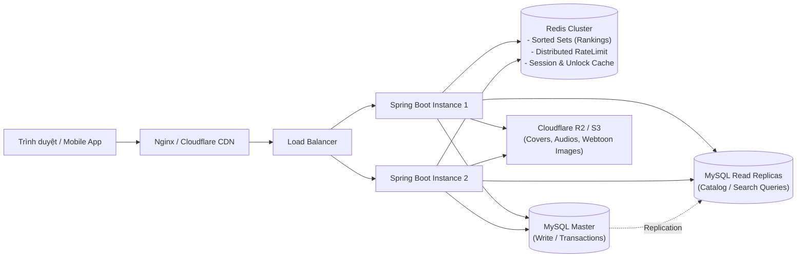
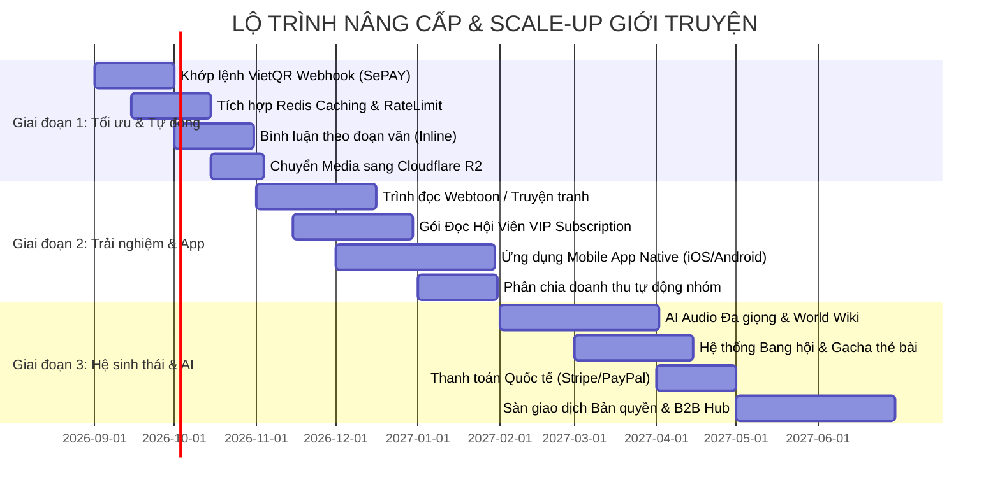

# GIỚI TRUYỆN — LỘ TRÌNH TÍNH NĂNG MỞ RỘNG & KIẾN TRÚC SCALE-UP TOÀN DIỆN

> **Tài liệu chiến lược sản phẩm & kỹ thuật mở rộng**  
> **Áp dụng cho:** Nền tảng đọc và xuất bản truyện Giới Truyện ([gioitruyen.com](https://gioitruyen.com))  
> **Trạng thái nền tảng gốc:** Monolith (Java 21, Spring Boot 3.5.4, MySQL 8.4, React 18 / Vite 5, Redis)  
> **Mục tiêu scale-up:** Nâng cấp hệ sinh thái tính năng, mở rộng mô hình kinh tế sáng tạo (Creator Economy), tối ưu hóa trải nghiệm đọc đa phương tiện và chuẩn bị hạ tầng chịu tải từ **10.000 DAU** lên **1.000.000+ DAU (Daily Active Users)**.

---

## MỤC LỤC

1. [Tổng quan mục tiêu & Chiến lược Scale-up](#1-tổng-quan-mục-tiêu--chiến-lược-scale-up)
2. [Trụ cột 1: Trải nghiệm Đọc Thế hệ Mới & Đa phương tiện](#2-trụ-cột-1-trải-nghiệm-đọc-thế-hệ-mới--đa-phương-tiện)
3. [Trụ cột 2: Hệ sinh thái Tác giả & Studio Xuất bản (Creator Economy 2.0)](#3-trụ-cột-2-hệ-sinh-thái-tác-giả--studio-xuất-bản-creator-economy-20)
4. [Trụ cột 3: Xã hội hóa Đọc truyện & Siêu Gamification (Social Reading & Gamification)](#4-trụ-cột-3-xã-hội-hóa-đọc-truyện--siêu-gamification-social-reading--gamification)
5. [Trụ cột 4: Cổng Thanh toán Tự động & Mở rộng Đa quốc gia (Global Payments)](#5-trụ-cột-4-cổng-thanh-toán-tự-động--mở-rộng-đa-quốc-gia-global-payments)
6. [Trụ cột 5: Hệ sinh thái Di động & Đa nền tảng (Native Apps & E-Reader)](#6-trụ-cột-5-hệ-sinh-thái-di-động--đa-nền-tảng-native-apps--e-reader)
7. [Trụ cột 6: Kiến trúc Kỹ thuật Hạ tầng & Hiệu năng Cao (Technical Scaling & Infrastructure)](#7-trụ-cột-6-kiến-trúc-kỹ-thuật-hạ-tầng--hiệu-năng-cao-technical-scaling--infrastructure)
8. [Trụ cột 7: B2B, Nền tảng Đối tác & Thị trường Bản quyền Số (Licensing & API)](#8-trụ-cột-7-b2b-nền-tảng-đối-tác--thị-trường-bản-quyền-số-licensing--api)
9. [Lộ trình Triển khai Theo Giai đoạn (Implementation Phasing Roadmap)](#9-lộ-trình-triển-khai-theo-giai-đoạn-implementation-phasing-roadmap)
10. [Ma trận Đánh giá Mức độ Ưu tiên & Tác động (Priority Matrix)](#10-ma-trận-đánh-giá-mức-độ-ưu-tiên--tác-động-priority-matrix)

---

## 1. TỔNG QUAN MỤC TIÊU & CHIẾN LƯỢC SCALE-UP

Hệ thống hiện tại của Giới Truyện đã có nền tảng vững chắc:
- Quản lý giao dịch và dòng tiền nghiêm ngặt (sổ cái `wallet_transactions`, `team_ledger`, `SELECT FOR UPDATE`, chống trừ tiền 2 lần).
- Đọc truyện chữ (Text), truyện ngắn (Zhihu Oneshots), truyện Audio.
- Hệ thống bóc tách tệp tải lên linh hoạt (`.docx`, `.epub`, `.odt`, `.rtf`, `.html`, `.txt`, `.md`) với tính năng kiểm tra toàn vẹn số từ và cảnh báo thiếu chương.
- Hệ thống chiến dịch PR ký quỹ (`pr_campaigns`, `pr_quest_claims`), mua gói Bố cáo trang chủ, nhiệm vụ hàng ngày.

Để chuyển đổi từ một **trang web đọc truyện** thành một **Nền tảng Kinh tế Nội dung Số & Mạng xã hội Văn học**, dự án cần mở rộng theo 7 trụ cột chiến lược dưới đây.



---

## 2. TRỤ CỘT 1: TRẢI NGHIỆM ĐỌC THẾ HỆ MỚI & ĐA PHƯƠNG TIỆN

```
                               ┌── AI TTS Đa Giọng Cảm Xúc (Bắc/Trung/Nam)
                               ├── Webtoon / Manga Infinite Canvas Viewer
TRẢI NGHIỆM ĐỌC ĐA PHƯƠNG TIỆN ├── Bình Luận Ghim Theo Đoạn Văn (Inline Comments)
                               ├── Nhạc Nền / Ambient Sound Tự Động Theo Cảnh
                               └── PWA & Đọc Ngoại Tuyến (Offline Sync Engine)
```

### 1.1 Trình đọc Webtoon / Truyện tranh (Manga/Manhwa Infinite Canvas)
- **Vấn đề hiện tại:** Hệ thống đang tối ưu chủ yếu cho văn bản (`TEXT`) và âm thanh (`AUDIO`). Độc giả truyện tranh yêu cầu trải nghiệm cuộn liên tục, không ngắt quãng và tải ảnh tức thời.
- **Tính năng mở rộng:**
  - **Infinite Vertical Canvas:** Tải trước (pre-fetching) 3 trang tiếp theo thông qua IntersectionObserver.
  - **Tile Slicing & Progressive Loading:** Tự động cắt lát ảnh lớn và chuyển đổi sang định dạng `AVIF`/`WebP` đa độ phân giải (tối ưu 4G/5G).
  - **Smart Pinch-to-Zoom:** Phóng to chi tiết khung tranh không vỡ hình trên di động.
  - **Chế độ đọc lật trang (Double-page / Right-to-Left):** Phục vụ độc giả Manga truyền thống.

### 1.2 Trợ lý Đọc Sách Giọng AI Thế hệ Mới (AI Multi-Voice & Contextual TTS)
- **Vấn đề hiện tại:** Audio hiện nay đòi hỏi file thu sẵn hoặc TTS đơn điệu chưa truyền tải được cảm xúc truyện dài.
- **Tính năng mở rộng:**
  - **Phân vai nhân vật tự động (Multi-Speaker Dialogue Parsing):** Tách lời thoại và lời dẫn truyện để gắn các giọng AI khác nhau (Giọng dẫn trầm ấm, giọng nữ chính ngọt ngào, giọng phản diện sắc bén).
  - **Hỗ trợ phương ngữ Bắc - Trung - Nam:** Độc giả tùy chọn giọng đọc theo sở thích vùng miền.
  - **Voice Cloning cho Tác giả / Dịch giả:** Cho phép tác giả huấn luyện mẫu giọng của chính mình để đọc độc quyền cho tác phẩm của họ.
  - **Bảng điều khiển tốc độ thông minh:** Tự động hạ tốc độ khi gặp đoạn mô tả kịch tính hoặc tăng tốc ở các đoạn hội thoại dài.

### 1.3 Bình luận Ghim Theo Đoạn Văn (Inline Paragraph Comments)
- **Cơ chế:** Độc giả bôi đen hoặc bấm vào biểu tượng bên cạnh mỗi đoạn văn để bình luận trực tiếp vào đúng ngữ cảnh (tương tự Zhihu, Medium, Wattpad).
- **Lợi ích:** Tăng độ tương tác (engagement) lên 300–500% so với bình luận cuối trang.
- **Thiết kế kỹ thuật:**
  ```sql
  CREATE TABLE paragraph_comments (
      id BIGINT AUTO_INCREMENT PRIMARY KEY,
      chapter_id BIGINT NOT NULL,
      paragraph_index INT NOT NULL,
      user_id BIGINT NOT NULL,
      content TEXT NOT NULL,
      likes_count INT DEFAULT 0,
      status VARCHAR(20) DEFAULT 'ACTIVE',
      created_at TIMESTAMP DEFAULT CURRENT_TIMESTAMP,
      INDEX idx_chapter_paragraph (chapter_id, paragraph_index)
  );
  ```

### 1.4 Âm thanh Bối cảnh & Nhạc Nền Tự Động (Dynamic Atmosphere Audio)
- Tác giả hoặc biên tập viên có thể gán nhạc nền nhẹ (lo-fi, cổ phong, mưa rơi, tiếng kiếm hiệp) theo từng chương.
- Chế độ "Đọc thư giãn": Tự động phát âm thanh sóng biển/mưa khi độc giả kích hoạt chế độ đêm.

### 1.5 Đọc Ngoại Tuyến Hoàn Toàn (PWA / Offline Chapter Cache)
- Tích hợp **Service Worker + IndexedDB**: Độc giả có thể tải trước 10, 50 hoặc toàn bộ chương đã mở khoá để đọc trên máy bay, tàu xe khi mất kết nối Internet.
- Tự động đồng bộ tiến độ đọc (`reading_progress`) lên máy chủ ngay khi thiết bị có mạng trở lại.

---

## 3. TRỤ CỘT 2: HỆ SINH THÁI TÁC GIẢ & STUDIO XUẤT BẢN (CREATOR ECONOMY 2.0)

```
                            ┌── Trợ Lý Viết AI & Quản Lý Thế Giới (World-building Wiki)
                            ├── Gói Đọc Hội Viên Định Kỳ (VIP Subscription Pass)
STUDIO XUẤT BẢN & MONETIZE  ├── Chia Doanh Thu Tự Động Nội Bộ Nhóm (Multi-tier Split)
                            ├── Gây Quỹ Tác Phẩm & Đặt Trước Bản In (Crowdfunding)
                            └── Chống Cào Dữ Liệu Nâng Cao (Canvas DRM & Glyph Obfuscation)
```

### 2.1 Studio Sáng tác Chuyên nghiệp & Trợ lý Viết AI (AI Writing Co-pilot)
- **World-Building & Lore Wiki Tool:**
  - Cửa sổ bên cạnh trình soạn thảo giúp quản lý hồ sơ nhân vật (tên, ngoại hình, cấp bậc võ công, mối quan hệ), dòng thời gian và địa danh.
  - Tự động phát hiện khi tác giả dùng sai tên nhân vật hoặc vi phạm logic thiết lập trước đó.
- **AI Co-pilot Hỗ trợ Văn phong:**
  - Gợi ý từ ngữ miêu tả cảnh vật, tâm trạng nhân vật, hành động chiến đấu.
  - Tự động kiểm tra lỗi chính tả tiếng Việt, dấu câu, lặp từ, văn phong Hán Việt.
- **Tự động lưu & Lịch sử phiên bản (Version Control for Authors):**
  - Lưu nháp tự động mỗi 10 giây.
  - Phục hồi lại bất kỳ mốc thời gian nào trong 30 ngày qua (Git-like timeline cho từng chương).

### 2.2 Mô hình Đăng ký Hội viên VIP (Monthly VIP / Tiered Subscription)
- **Mô hình hiện tại:** Mua lẻ từng chương (`chapter_unlocks`) hoặc mua combo trọn bộ (`story_combo_purchases`).
- **Mở rộng thêm:**
  - **VIP Pass Toàn sàn:** Thuê bao 99.000 Xu/tháng để đọc không giới hạn toàn bộ truyện trong danh mục VIP.
  - **Fanclub Độc quyền cho Tác giả / Nhóm:** Độc giả trả phí tháng (ví dụ 30.000 Xu/tháng) cho một nhóm dịch/tác giả cụ thể để được đọc trước 5–10 chương chưa công khai, nhận huy hiệu Fan Cứng và icon chat riêng.
  - **Doanh thu chia sẻ dựa trên thời gian đọc (Read-time Pool Allocation):** Phân bổ doanh thu gói VIP Pass cho các tác giả dựa trên tổng thời lượng và số từ độc giả đã đọc.

### 2.3 Phân chia Doanh thu Tự động cho Thành viên Nhóm (Team Revenue Split Automation)
- **Vấn đề hiện tại:** Doanh thu nhóm đổ 100% về ví của `OWNER`. Chủ nhóm phải tự tính toán và chuyển khoản thủ công cho dịch giả, biên tập viên, người des bìa.
- **Tính năng mở rộng:**
  - Cho phép Chủ nhóm thiết lập tỷ lệ phân chia tự động (ví dụ: Dịch giả 60%, Edit 20%, Quỹ nhóm 20%).
  - Khi có giao dịch mở chương, hệ thống tự động chia Xu về từng ví cá nhân ngay trong một Database Transaction duy nhất, giảm tải 100% công sức quản lý tài chính cho nhóm.

### 2.4 Gây quỹ Tác phẩm & Đặt hàng Viết theo Yêu cầu (Crowdfunding & Bounties)
- **Mục tiêu quyên góp (Milestone Goals):** Nhóm dịch/Tác giả đặt mốc "Đạt 500.000 Xu để bão 20 chương" hoặc "Đạt 5.000.000 Xu để in sách tặng kèm goods".
- **Hệ thống đặt chương ngoại truyện:** Độc giả chi Xu tạo yêu cầu viết ngoại truyện cho cặp đôi mình yêu thích; tác giả chấp nhận thì nhận tiền ký quỹ sau khi hoàn thành.

### 2.5 Công nghệ Chống Đạo Văn & Chống Cào Dữ liệu Tinh vi (Anti-scraping & DRM Engine)
- **Canvas / WebGL Text Rendering:** Kết xuất nội dung văn bản dưới dạng vector/canvas động trên client, khiến các extension copy và tool cào HTML không thể lấy văn bản thuần.
- **Font Glyph Scrambling (Xáo trộn bảng mã Font chữ động):** Mỗi phiên đọc tải về một font chữ được hoán đổi mã Unicode ngẫu nhiên. Kẻ trộm cào được văn bản sẽ chỉ nhận chuỗi ký tự vô nghĩa nếu không có font giải mã.
- **Invisible Steganographic Watermark:** Chèn mã ID độc giả ẩn dạng watermark vô hình trong canvas hoặc giữa các khoảng trắng (Zero-width characters). Nếu truyện bị lọt ra ngoài, ban quản trị chỉ cần quét là biết ngay tài khoản nào làm rò rỉ để xử lý pháp lý.

---

## 4. TRỤ CỘT 3: XÃ HỘI HÓA ĐỌC TRUYỆN & SIÊU GAMIFICATION

```
                           ┌── Hệ Thống Tông Môn / Bang Hội Độc Giả (Reader Guilds)
                           ├── Bậc Tu Tiên & Cảnh Giới Đọc (Cultivation Ranks)
XÃ HỘI HÓA & GAMIFICATION ├── Thẻ Bài Nhân Vật & Bộ Sưu Tập Số (Character Collectibles)
                           ├── Quà Tặng Đồ Họa Toàn Màn Hình (Live Virtual Gifting)
                           └── Đấu Trường Sáng Tác & Bầu Chọn Cuối Năm (Annual Awards)
```

### 3.1 Hệ thống Tông Môn / Bang Hội Độc Giả (Reader Guilds / Sects)
- Độc giả có thể tự lập hoặc gia nhập các Tông môn/Bang hội (ví dụ: *Vạn Kiếm Tông, Tiêu Dao Cung, Hội Mê Ngôn Tình*).
- **Bang Chiến Đề Cử (Guild Wars):** Hàng tháng, các bang hội gom Ngọc/Xu để đẩy truyện của Bang mình lên đỉnh bảng xếp hạng. Bang hội đứng đầu nhận khung avatar độc quyền và tăng tỷ lệ nhận thưởng nhiệm vụ ngày cho toàn bộ thành viên.
- **Kho Tàng Bang Hội:** Các thành viên đóng góp xu vào quỹ chung để mua quyền đọc chung các bộ combo truyện đắt giá.

### 3.2 Hệ thống Cảnh Giới Đọc Sách Động (Cultivation & Level Progression)
- Đổi mới việc tích lũy điểm kinh nghiệm dựa trên: Thời gian đọc thực tế, số chương đã mở, số lượng bình luận chất lượng, số nhiệm vụ hoàn thành.
- **Hệ thống Cảnh giới tùy biến theo thể loại:**
  - Thể loại Tiên hiệp: *Luyện Khí → Trúc Cơ → Kim Đan → Nguyên Anh → Hóa Thần → Độ Kiếp*.
  - Thể loại Đô thị / Ngôn tình: *Thực tập sinh → Trợ lý → Giám đốc → Tổng tài bá đạo*.
- Khi đột phá cảnh giới mới: Mở khoá hiệu ứng bình luận phát sáng, danh hiệu hiển thị cạnh tên, giảm % phí nạp xu.



### 3.3 Thẻ bài Nhân vật & Gacha Độc quyền (Digital Collectible Cards)
- Khi độc giả mở khoá chương mới hoặc hoàn thành bộ truyện, có tỷ lệ rơi các thẻ bài nhân vật (độ hiếm: `C`, `R`, `SR`, `SSR`, `UR`).
- Độc giả có thể trưng bày bộ bài trên trang cá nhân hoặc ghép đủ bộ để đổi lấy Xu thưởng, gói quà tặng vật phẩm thực tế (Bookmark, Áo thun, Standee).

### 3.4 Quà Tặng Ảo Cao Cấp Hiệu Ứng Toàn Màn Hình (Dynamic Virtual Gifting)
- Độc giả ủng hộ tác giả không chỉ bằng nút donate đơn giản mà qua các vật phẩm ảo đặc sắc:
  - *Tẩy Tủy Đan* (100 Xu) → Hiệu ứng phát sáng nhẹ.
  - *Phi Kiếm Hoàng Kim* (2.000 Xu) → Hiệu ứng kiếm bay ngang màn hình.
  - *Tòa Thành Đỉnh Phong / Du Thuyền* (50.000 Xu) → Thông báo chạy toàn sàn (Server-wide Broadcast Banner) vinh danh đại gia ủng hộ tác phẩm.

---

## 5. TRỤ CỘT 4: CỔNG THANH TOÁN TỰ ĐỘNG & MỞ RỘNG ĐA QUỐC GIA

```
                           ┌── Tự Động Khớp Lệnh VietQR / SePAY / Casso (3s Auto-credit)
                           ├── Ví Điện Tử Nội Địa (MoMo, ZaloPay, Viettel Money, VNPay)
THANH TOÁN & QUỐC TẾ HÓA  ├── Thanh Toán Quốc Tế Toàn Diện (Stripe, PayPal, Apple Pay)
                           ├── Cổng Thẻ Cào Viễn Thông Tự Động (Telco Fast Gateway)
                           └── Đa Ngôn Ngữ (i18n: vi, en, zh, ko) & Đa Bản Vị Tiền Tệ
```

### 4.1 Tự động Khớp Lệnh VietQR & Webhook Ngân Hàng Tức Thời (3-Second Auto Top-up)
- **Vấn đề hiện tại:** Nạp tiền chuyển khoản ngân hàng phải chờ Admin duyệt thủ công (`PENDING` → Admin check bill → `APPROVED`), gây nghẽn lúc nửa đêm hoặc giờ cao điểm.
- **Giải pháp mở rộng:**
  - Tích hợp Webhook kết nối trực tiếp với tài khoản ngân hàng thông qua **SePAY / Casso**.
  - Sinh mã thanh toán độc nhất `GT<user_id>_<random>` trong nội dung chuyển khoản.
  - Xử lý Webhook theo cơ chế Idempotent (chống cộng tiền trùng lặp), tự động cộng Xu vào ví người dùng trong **3 giây** kể cả 2 giờ sáng.
  - Lưu trữ nhật ký webhook và cơ chế retry tự động khi hệ thống bảo trì.

### 4.2 Cổng Thanh toán Toàn cầu cho Độc giả Nước ngoài
- Tích hợp **Stripe & PayPal Checkout**: Cho phép kiều bào và độc giả quốc tế nạp Xu trực tiếp bằng thẻ tín dụng quốc tế (Visa, Mastercard, JCB, Amex) hoặc Apple Pay / Google Pay.
- Tích hợp **In-App Purchase (IAP)**: Nạp tiền trực tiếp qua tài khoản Apple App Store và Google Play Store trên ứng dụng di động.

### 4.3 Đa ngôn ngữ (i18n) & Đa Bản Vị Tiền tệ
- Hệ thống hỗ trợ đa ngôn ngữ giao diện: Tiếng Việt, Tiếng Anh, Tiếng Trung, Tiếng Hàn.
- Tự động hiển thị tương đương giá theo tiền tệ địa phương (VND, USD, EUR, JPY, KRW) dựa trên IP truy cập nhưng vẫn quy về đơn vị chuẩn **Xu** trong sổ cái backend.

---

## 6. TRỤ CỘT 5: HỆ SINH THÁI DI ĐỘNG & ĐA NỀN TẢNG

```
                          ┌── Native Apps iOS & Android (Flutter / React Native)
                          ├── Chế Độ Tối Ưu Máy Đọc Sách E-Ink (Boox, Kindle Android)
ỨNG DỤNG ĐA NỀN TẢNG     ├── Push Notifications Tức Thời (FCM Chương Mới / Đơn Hàng)
                          ├── Widget Màn Hình Chính (Tiến Độ Đọc / Điểm Danh)
                          └── Ứng Dụng Desktop / Web Clipper Sáng Tác Ngoại Tuyến
```

### 5.1 Ứng dụng Di động Native (iOS & Android)
- **Công nghệ đề xuất:** React Native hoặc Flutter (chia sẻ logic mã nguồn, hiệu năng 60–120 FPS).
- **Tính năng độc quyền trên App:**
  - **Lật trang 3D chân thực (Page Flip Animation):** Mô phỏng trang sách giấy vật lý với độ trễ cực thấp.
  - **Điều khiển cử chỉ (Gesture Control):** Vuốt để tăng giảm độ sáng, gõ mép màn hình để sang chương, lắc máy để đổi truyện ngẫu nhiên.
  - **Phát âm thanh chạy nền (Background Audio Player):** Tích hợp điều khiển Audio ngoài màn hình khóa (Lockscreen & Dynamic Island trên iOS).

### 5.2 Chế độ Tối ưu cho Máy Đọc Sách Màn Hình E-Ink
- Giao diện đơn sắc (Monochrome High-Contrast Mode), loại bỏ toàn bộ hiệu ứng chuyển động mờ (blur/animations).
- Tích hợp nút chuyển trang bằng phím âm lượng vật lý của máy đọc sách (Onyx Boox, Meebook, Likebook).

### 5.3 Thông báo Đẩy Thời gian Thực (Push Notifications Engine)
- Tích hợp **Firebase Cloud Messaging (FCM) & Apple APNs**:
  - Thông báo ngay lập tức khi truyện đang theo dõi ra chương mới (độ trễ < 1 giây).
  - Nhắc nhở điểm danh nhận quà hàng ngày lúc 20:00.
  - Báo động tức thì khi có người trả lời bình luận hoặc nhận tiền thưởng nhiệm vụ PR.

---

## 7. TRỤ CỘT 6: KIẾN TRÚC KỸ THUẬT HẠ TẦNG & HIỆU NĂNG CAO

```
                      ┌── Database Read/Write Splitting & Sharding
                      ├── Đưa Redis Vào Tầng Caching Toàn Diện (Leaderboard, Session, RateLimit)
HẠ TẦNG & HIỆU NĂNG  ├── Tách Media Sang Cloudflare R2 / AWS S3 + CDN
                      ├── Bộ Máy Tìm Kiếm Chuyên Sâu Meilisearch / Elasticsearch
                      └── Hàng Đợi Bất Đồng Bộ RabbitMQ / Kafka cho Tác Vụ Nặng
```

### 7.1 Tái cấu trúc Caching Toàn Diện với Redis
- **Hiện trạng:** Redis đã cài đặt ở cổng 6379 nhưng chưa được khai thác. Tần suất truy vấn dồn trực tiếp vào MySQL.
- **Triển khai mở rộng:**
  - **Bảng Xếp Hạng Siêu Tốc (Redis Sorted Sets - `ZSET`):** Lưu bảng xếp hạng Ngày / Tuần / Tháng / Đề cử trên Redis, cập nhật điểm số O(log N) mà không cần câu lệnh SQL `SUM()` nặng nề trên bảng hàng triệu dòng.
  - **Distributed Rate Limiting (Redis Token Bucket):** Chuyển toàn bộ bộ đếm giới hạn IP / User từ bộ nhớ RAM của tiến trình sang Redis cluster, cho phép mở rộng chạy 5–10 cụm Spring Boot phía sau load balancer.
  - **Metadata & Permission Cache:** Cache thông tin truyện, danh sách chương và trạng thái mở khoá (`chapter_unlocks:{userId}:{chapterId}`) với TTL thông minh để giảm 90% tải Database.



### 7.2 Phân tách Đọc/Ghi CSDL (Read/Write Splitting) & Lưu trữ Đám mây (Object Storage)
- **MySQL Master - Replica:**
  - `Master Node`: Chuyên xử lý ghi giao dịch tiền (`wallets`, `wallet_transactions`, `chapter_unlocks`, `payments`).
  - `Replica Nodes`: Chuyên phục vụ đọc nội dung chương, danh mục truyện, thống kê lượt đọc.
- **Di dời Media sang Cloudflare R2 / AWS S3:**
  - Thay vì lưu ảnh và audio trực tiếp trên ổ cứng VPS (`/uploads/`), chuyển toàn bộ sang Cloudflare R2 để miễn phí băng thông truyền tải (zero egress fee), kết hợp Cloudflare Image Resizing tự động tạo thumbnail theo kích thước màn hình.

### 7.3 Công cụ Tìm kiếm Chuyên sâu (Meilisearch / Elasticsearch)
- **Hiện trạng:** Tìm kiếm đang dùng SQL `LIKE '%keyword%'` trên MySQL, dễ gây nghẽn CPU khi dữ liệu đạt hàng triệu chương và hàng trăm ngàn lượt tìm kiếm/ngày.
- **Nâng cấp:**
  - Tích hợp **Meilisearch** hoặc **Elasticsearch**: Hỗ trợ tìm kiếm tiếng Việt không dấu, tìm gần đúng (Typo-tolerant: gõ "tien hiep" ra "Tiên Hiệp"), tìm kiếm theo trích đoạn bên trong nội dung chương, bộ lọc đa tiêu chí (số chương, tình trạng hoàn thành, điểm đánh giá, tag độc quyền) với tốc độ phản hồi < 15ms.

### 7.4 Hàng đợi Xử lý Bất đồng bộ (RabbitMQ / Apache Kafka)
- Chuyển các tác vụ nặng sang chạy nền qua hàng đợi Message Queue:
  - Bóc tách và định dạng tệp truyện lớn (>2.500 chương).
  - Xử lý chuyển đổi định dạng âm thanh / video / nén ảnh webtoon.
  - Gửi email kích hoạt, thông báo đẩy hàng loạt khi tác giả ra chương mới.
  - Quét dọn các giao dịch nạp quá hạn và tổng hợp sổ doanh thu cuối ngày.

### 7.5 Hệ thống Giám sát & Báo động Tự động (Observability & Alerting)
- **Prometheus + Grafana:** Giám sát QPS, Latency p95/p99, JVM Garbage Collection, Pool kết nối MySQL HikariCP, tỷ lệ cache hit/miss của Redis.
- **Sentry / OpenTelemetry:** Tự động bắt lỗi ngoại lệ trên Frontend và Backend, gửi cảnh báo trực tiếp về kênh Telegram của đội ngũ kỹ thuật trong 5 giây nếu phát sinh lỗi luồng tiền.

---

## 8. TRỤ CỘT 7: B2B, NỀN TẢNG ĐỐI TÁC & THỊ TRƯỜNG BẢN QUYỀN SỐ

```
                         ┌── Sàn Giao Dịch Bản Quyền Chuyển Thể (IP Licensing Marketplace)
                         ├── Public API & Webhook Dành Cho Đối Tác Xuất Bản
THỊ TRƯỜNG & ĐỐI TÁC B2B ├── Mạng Lưới Tiếp Thị Liên Kết 2.0 (Creator Affiliate & Deep Tracking)
                         └── Máy Chủ Quảng Cáo Nội Bộ (Direct Sponsor Ad-Server & Prebid)
```

### 8.1 Sàn Giao dịch Bản quyền Tác phẩm (IP Rights & Licensing Marketplace)
- Kết nối các tác giả độc quyền trên Giới Truyện với các đơn vị chuyển thể:
  - Công ty sản xuất phim hoạt hình 2D/3D (Donghua/Anime).
  - Studio phát triển game di động (Audio Game, Visual Novel, RPG).
  - Các nhà xuất bản sách giấy truyền thống.
- Hỗ trợ hợp đồng thông minh điện tử và cơ chế đấu giá quyền khai thác chuyển thể thương mại.

### 8.2 Nền tảng Tiếp thị Liên kết Nâng cao (Creator Affiliate 2.0)
- Cung cấp công cụ sinh link tiếp thị riêng cho các Reviewer / KOC / TikToker / Facebook Page.
- Độc giả bấm vào link review để đăng ký và nạp Xu → Reviewer được chia hoa hồng trọn đời từ các giao dịch của người dùng đó với Dashboard thống kê theo thời gian thực (Real-time Attribution Funnel).

### 8.3 Máy chủ Quảng cáo Nội bộ (Direct-Sold Ad Server)
- Thay vì phụ thuộc hoàn toàn vào mạng quảng cáo ngoài (như AdSense thường có RPM thấp), phát triển hệ thống **Ad-Server nội bộ**:
  - Cho phép các thương hiệu game, trà sữa, thiết bị công nghệ mua vị trí hiển thị (Banner đầu trang, Popup giữa chương, Interstitial sau 5 chương) theo cơ chế CPM/CPC.
  - Targeting chính xác theo thể loại truyện độc giả đang đọc (ví dụ: Game tiên hiệp hiển thị độc quyền trong truyện Tiên hiệp).

---

## 9. LỘ TRÌNH TRIỂN KHAI THEO GIAI ĐOẠN (IMPLEMENTATION PHASING ROADMAP)



### Chi tiết các mốc mục tiêu:

#### **Giai đoạn 1: Ổn định Hạ tầng, Caching & Tự động hóa Dòng tiền (Tháng 1 - 2)**
1. **Tự động hóa Nạp tiền 24/7:** Tích hợp SePAY / Casso webhook, xóa bỏ 100% việc admin phải duyệt tay từng lệnh nạp ngân hàng.
2. **Khai thác Toàn bộ Sức mạnh Redis:** Chuyển bảng xếp hạng, session và rate limiter sang Redis.
3. **Bình luận theo đoạn văn:** Đưa tính năng bình luận inline vào trang đọc để tăng tương tác.
4. **Tách Media ra Cloudflare R2:** Giảm 80% dung lượng đĩa cứng VPS và giảm tải băng thông mạng.

#### **Giai đoạn 2: Nâng cấp Trải nghiệm Đọc, Creator Studio & Mobile App (Tháng 3 - 5)**
1. **Mở rộng Trình đọc Webtoon / Truyện tranh:** Thu hút đối tượng độc giả tranh ảnh với trình đọc cuộn mượt.
2. **Mô hình VIP Subscription:** Ra mắt gói đọc tháng toàn sàn và Fanclub độc quyền cho tác giả.
3. **Phát triển Mobile App Native:** Phát hành ứng dụng trên Apple App Store và Google Play Store có tính năng lật trang mượt và đọc offline.
4. **Tự động chia tiền thành viên nhóm:** Giúp các nhóm dịch lớn dễ dàng vận hành với cơ chế chia % tự động.

#### **Giai đoạn 3: Gamification, AI Audio & Mở rộng Quy mô Toàn cầu (Tháng 6 - 9)**
1. **Hệ thống AI Audio Đa giọng & TTS Cảm xúc:** Đổi mới trải nghiệm nghe truyện bằng giọng đọc phân vai tự động.
2. **Siêu Gamification (Bang hội, Tu tiên, Thẻ bài):** Biến việc đọc truyện thành trò chơi nhập vai sống động.
3. **Mở rộng Cổng Thanh toán Toàn cầu:** Đón nhận độc giả quốc tế qua Stripe, PayPal, Apple Pay.
4. **Sàn Giao dịch Bản quyền Số B2B:** Ký kết các hợp đồng chuyển thể tác phẩm cho phim, truyện tranh và game.

---

## 10. MA TRẬN ĐÁNH GIÁ MỨC ĐỘ ƯU TIÊN & TÁC ĐỘNG (PRIORITY MATRIX)

| Tính năng / Hạng mục | Độ phức tạp kỹ thuật | Tác động doanh thu / Tăng trưởng | Mức độ ưu tiên | Gợi ý triển khai |
|---|:---:|:---:|:---:|---|
| **Nạp tiền VietQR Tự Động 24/7 (Webhook)** | Thấp | 🔴 Cực Cao | **P0 (Khẩn cấp)** | Triển khai ngay để tăng tỷ lệ hoàn tất nạp và giảm tải admin |
| **Redis Caching Bảng xếp hạng & RateLimit** | Trung bình | 🔴 Cực Cao (Chống sập) | **P0 (Khẩn cấp)** | Giúp hệ thống chịu tải gấp 10x mà không cần nâng cấp VPS |
| **Chuyển Ảnh/Media sang Cloudflare R2** | Thấp | 🟡 Cao (Tiết kiệm chi phí) | **P0 (Khẩn cấp)** | Giải phóng ổ cứng VPS, tăng tốc độ load ảnh toàn cầu |
| **Bình luận ghim theo đoạn văn (Inline)** | Trung bình | 🟡 Cao (Tăng Retetion) | **P1 (Quan trọng)** | Tăng thời gian on-site và mức độ gắn kết của độc giả |
| **Gói Đọc Hội Viên VIP Subscription** | Trung bình | 🔴 Cực Cao | **P1 (Quan trọng)** | Tạo dòng tiền định kỳ ổn định hàng tháng (MRR) |
| **Phân chia doanh thu tự động cho Nhóm** | Trung bình | 🟡 Cao (Hút nhóm dịch) | **P1 (Quan trọng)** | Thu hút các nhóm dịch lớn chuyển nhà về Giới Truyện |
| **Ứng dụng Native App (iOS & Android)** | Cao | 🔴 Cực Cao | **P1 (Quan trọng)** | Khai thác 85% lưu lượng đọc truyện trên điện thoại |
| **Trình đọc Webtoon / Truyện tranh** | Trung bình | 🟡 Cao (Mở rộng tệp user) | **P2 (Nên làm)** | Mở rộng danh mục sản phẩm ngoài truyện chữ |
| **Trợ lý Sáng tác AI & World Lore Wiki** | Cao | 🟢 Trung bình | **P2 (Nên làm)** | Tạo lợi thế cạnh tranh độc quyền cho studio xuất bản |
| **Hệ thống Bang Hội & Tu Tiên Gamification** | Cao | 🟡 Cao (Tăng Viral) | **P2 (Nên làm)** | Tăng tính cộng đồng và kích thích đua top nạp tiền |
| **Cổng Thanh toán Quốc tế (Stripe/PayPal)** | Trung bình | 🟡 Cao (Độc giả hải ngoại) | **P2 (Nên làm)** | Mở rộng doanh thu ra thị trường nước ngoài |
| **Sàn Giao dịch Bản quyền B2B** | Rất Cao | 🔴 Cực Cao (Dài hạn) | **P3 (Định hướng)** | Chuyển đổi định vị thành tập đoàn IP nội dung số |

---

## 11. KẾT LUẬN & NGUYÊN TẮC VẬN HÀNH KHI SCALE-UP

1. **Bảo toàn nguyên tắc Dòng tiền Bất biến:** Dù scale-up lên kiến trúc phân tán hay vi dịch vụ, nguyên tắc `SELECT FOR UPDATE`, đối chiếu sổ cái 2 đầu (`wallet_transactions` vs `wallets`) và khóa trạng thái giao dịch trước khi trừ tiền phải luôn được duy trì tuyệt đối.
2. **Trải nghiệm Độc giả là Trọng tâm:** Mọi tính năng mới (quảng cáo, nhiệm vụ, gacha) không được làm ảnh hưởng đến tốc độ tải trang chương (< 500ms) và sự liền mạch khi đọc.
3. **Tối ưu Chi phí Vận hành (Cost-to-Serve Optimization):** Sử dụng các giải pháp kiến trúc tối ưu (Redis Caching, Cloudflare R2, Connection Pooling, Asynchronous Processing) để hệ thống có thể phục vụ hàng triệu người dùng với chi phí máy chủ thấp nhất.

---
*Tài liệu được thiết kế riêng cho hệ sinh thái công nghệ Giới Truyện.*
