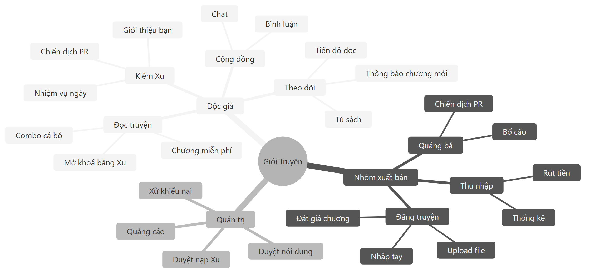
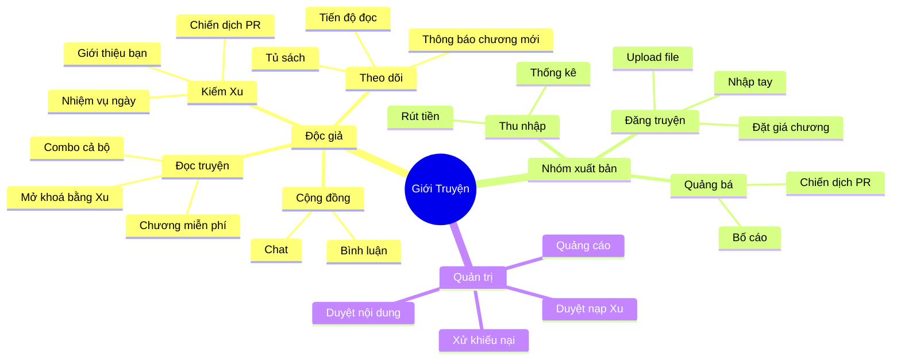

# Đặc tả tính năng

Mô tả **hành vi thật** của hệ thống đang chạy — cả những chỗ chưa xong và những chỗ đã
biết là có vấn đề.

| Tài liệu | Nội dung |
|---|---|
| [reading.md](reading.md) | Đọc truyện, mở khoá chương, tủ sách |
| [publishing.md](publishing.md) | Đăng truyện, upload file, quản lý chương |
| [monetization.md](monetization.md) | Xu, nạp, rút, combo, bố cáo |
| [pr-campaigns.md](pr-campaigns.md) | Chiến dịch PR ngoài nền tảng |
| [advertising.md](advertising.md) | AdSense và banner nội bộ |

---

## Bản đồ tính năng

Mã nguồn sơ đồ

---

## Trạng thái từng phần

| Tính năng | Trạng thái |
|---|---|
| Đọc truyện, mở khoá chương | Chạy |
| Upload file nhiều định dạng | Chạy |
| Chiến dịch PR | Chạy, chưa test qua UI thật |
| Bố cáo | Chạy |
| Nhiệm vụ ngày | Chạy |
| AdSense | Script đã nạp, **chưa có slot id** nên chưa hiển thị |
| Chat cộng đồng | Chạy |
| Rút tiền | Chạy, admin duyệt tay |
| SSR / prerender cho SEO | **Chưa có** |
| CMP (đồng ý cookie) | **Chưa có** — chỉ cần nếu có traffic EEA/UK |
| Đồng bộ số liệu AdSense | **Chưa có** — cần OAuth cho AdSense Management API |
