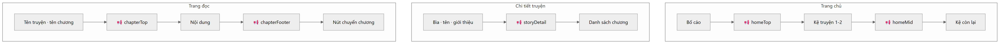

# Quảng cáo

Hai hệ thống độc lập.

---

## 1. Google AdSense

| Mục | Trạng thái |
|---|---|
| Publisher ID | `ca-pub-4260233431693229` |
| Script trong `<head>` | ✓ đã có |
| `ads.txt` | ✓ 200, `text/plain`, đúng định dạng |
| `robots.txt` / `sitemap.xml` | ✓ |
| HTTPS + chuyển hướng 301 | ✓ |
| CSP chặn Google | ✗ không có CSP nào |
| **Slot id** | ✗ **chưa có → chưa unit nào hiển thị** |

### Vì sao chưa thấy quảng cáo

`ADSENSE_SLOTS` để trống. Component trả `null` khi thiếu slot id — cố ý, vì một `<ins>`
không có `data-ad-slot` **không bao giờ fill** và bị tính là unfilled impression, trừ điểm
tài khoản.

Slot id đọc từ biến môi trường nên bật một vị trí là đổi cấu hình deploy, **không cần sửa
mã**:

```
VITE_ADSENSE_SLOT_CHAPTER_TOP
VITE_ADSENSE_SLOT_CHAPTER_FOOTER
VITE_ADSENSE_SLOT_CHAPTER_GATE
VITE_ADSENSE_SLOT_STORY_DETAIL
VITE_ADSENSE_SLOT_HOME_TOP
VITE_ADSENSE_SLOT_HOME_MID
VITE_ADSENSE_SLOT_CATALOG
```

### Vị trí đã đặt sẵn

```mermaid
flowchart TB
    subgraph home["Trang chủ"]
        H1["Bố cáo"] --> H2["📢 homeTop"] --> H3["Kệ truyện 1-2"] --> H4["📢 homeMid"] --> H5["Kệ còn lại"]
    end
    subgraph story["Chi tiết truyện"]
        S1["Bìa · tên · giới thiệu"] --> S2["📢 storyDetail"] --> S3["Danh sách chương"]
    end
    subgraph reader["Trang đọc"]
        R1["Tên truyện · tên chương"] --> R2["📢 chapterTop"] --> R3["Nội dung"] --> R4["📢 chapterFooter"] --> R5["Nút chuyển chương"]
    end
```



<details><summary>Mã nguồn sơ đồ</summary>



</details>

Nguyên tắc: **không chèn quảng cáo giữa các đoạn văn**, không đặt sát navigation, và giữ
chỗ sẵn (`min-height`) để creative về không đẩy đoạn đang đọc xuống.

`chapterGate` là màn chờ giữa hai chương — đếm ngược bằng **timer**, không khoá nội dung
sau quảng cáo. AdSense cấm điều kiện hoá nội dung theo việc xem quảng cáo.

### Auto Ads — đề xuất

| Format | Nên | Vì sao |
|---|:--:|---|
| Display/banner | ✓ | An toàn nhất |
| Multiplex | ✓ | Hợp chỗ "đọc xong, chọn gì tiếp" |
| Anchor mobile | ⚠ | Chỉ chân trang; anchor trên che tên chương |
| Vignette | ✗ | Độc giả chuyển chương liên tục, sẽ bị chặn mỗi lần — và đã có `chapterGate` |

### Cần chủ trang cung cấp

1. Trạng thái Sites trong AdSense (*Ready* / *Getting ready* / *Requires review*)
2. Policy center có vi phạm không
3. Ad serving có bị *limited* không
4. Slot id cho từng vị trí muốn bật
5. Có traffic EEA/UK không — nếu có thì **bắt buộc CMP**, hiện chưa có

---

## 2. Banner nội bộ

Bảng `advertisements` + `ad_events`, admin tự cấu hình.

Loại: `BANNER` · `POPUP` · `AFFILIATE_REDIRECT`
Vị trí: `GLOBAL_CLICK` · `STORY_OPEN` · `STORY_DETAIL` · `READER` · `HOME` · `SIDEBAR`

Có cooldown và trần click mỗi ngày mỗi người.

### Ghi nhận sự kiện

`IMPRESSION` khi banner được nạp trên trang, `REDIRECT` khi độc giả bấm. Dùng `keepalive`
để báo cáo sống sót qua lúc chuyển tab.

IP được **băm** trước khi lưu, không lưu IP thô.

> Endpoint ghi sự kiện có từ đầu nhưng **frontend chưa bao giờ gọi**, nên `ad_events`
> rỗng và bảng thống kê chỉ hiện 0 — đọc như banner hỏng. Khi nối vào thì lộ tiếp một lỗi
> nữa: service gán `@Id` rồi gọi `repository.save()`, Spring Data JDBC hiểu là "dòng đã
> tồn tại" nên phát UPDATE và mọi lượt ghi trả 500. Đã chuyển sang INSERT tường minh.

### Thống kê trong Overview admin

- Biểu đồ lượt hiển thị và click theo ngày
- Bảng hiệu quả theo vị trí: hiển thị · click · CTR · số banner đang bật
- Gợi ý chiến lược, **chỉ hiện khi vị trí đó đã đạt ≥100 hiển thị** — CTR tính từ vài chục
  lượt là nhiễu

Số liệu AdSense **không** nằm trong CSDL này. Chúng ở tài khoản AdSense và cần AdSense
Management API (OAuth riêng) mới đọc được. Bảng thống kê nói rõ điều đó thay vì vẽ biểu đồ
rỗng trông như sập traffic.
