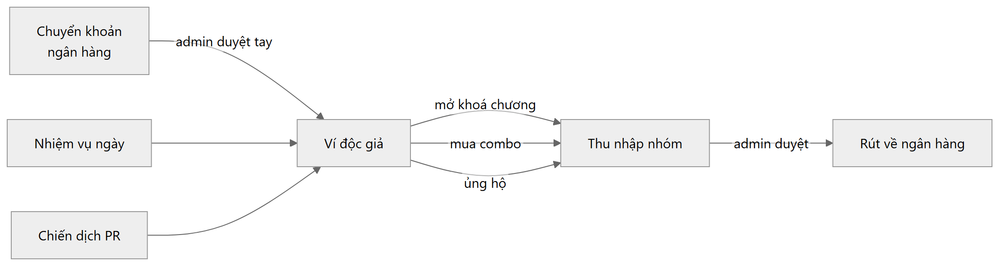
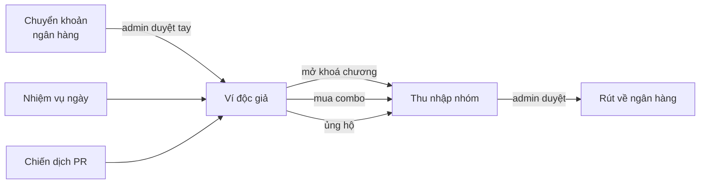
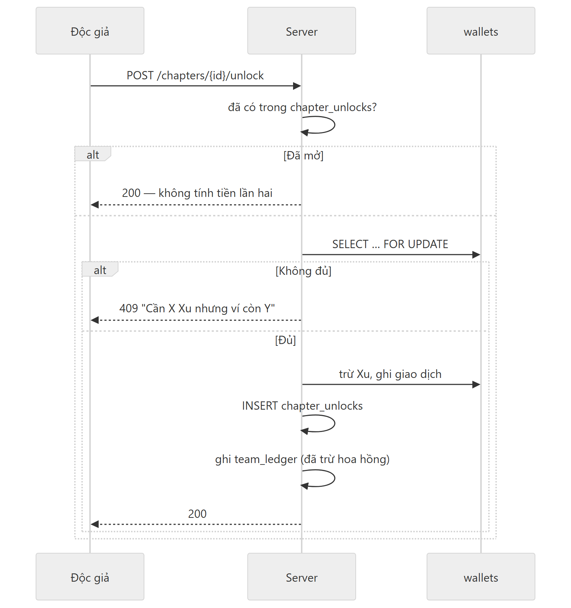
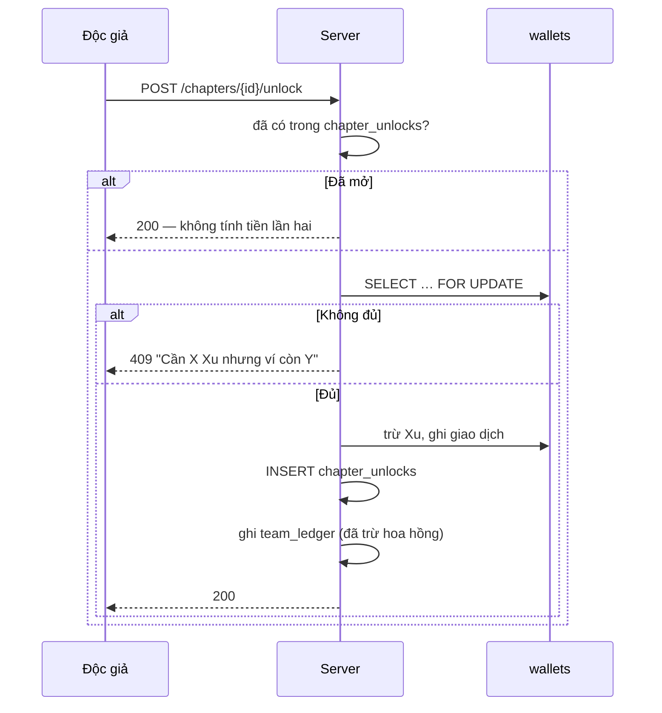

# Xu và dòng tiền

Xu là đơn vị tiền trong trang. Mọi thứ tính bằng Xu, không có số thập phân.



<details><summary>Mã nguồn sơ đồ</summary>



</details>

---

## Ví

Một người **một ví** (`wallets.user_id` UNIQUE). `coin_balance` có `CHECK >= 0`, nên
không thể âm dù ứng dụng có sai.

Mọi thay đổi số dư ghi một dòng `wallet_transactions` kèm `balance_after` — số dư ngay
sau giao dịch. Nhờ đó dựng lại được số dư tại bất kỳ thời điểm nào, và khi số dư lệch thì
tìm ra lệch từ đâu.

### Loại giao dịch

| Loại | Ý nghĩa |
|---|---|
| `DEPOSIT` | Nạp Xu |
| `PURCHASE` | Mở khoá chương, mua combo |
| `DONATION` | Ủng hộ nhóm |
| `EARNING` | Thu nhập nhóm vào ví chủ nhóm |
| `DAILY_REWARD` | Nhiệm vụ ngày |
| `REFUND` | Hoàn Xu |
| `WITHDRAWAL` | Rút tiền |
| `PR_ESCROW` | Ký quỹ chiến dịch PR (số âm) |
| `PR_REWARD` | Thưởng PR, và hoàn Xu chiến dịch |
| `ADMIN_ADJUSTMENT` | Admin chỉnh tay, gồm phán quyết khiếu nại |

---

## Không có ví nhóm

Điểm hay gây nhầm: **nhóm không có ví riêng**. Thu nhập của nhóm được cộng vào ví của
**chủ nhóm** dưới dạng `EARNING`. Bảng `team_ledger` là sổ đối chiếu, không giữ tiền.

Hệ quả thực tế: chủ nhóm publish chiến dịch PR thì Xu trừ khỏi **ví cá nhân của chính
họ**.

`team_ledger.net_coin` có `CHECK >= 0` nên **không ghi được khoản chi**. Chi tiêu của
nhóm chỉ để lại dấu ở `wallet_transactions`.

---

## Mở khoá chương



<details><summary>Mã nguồn sơ đồ</summary>



</details>

Một chương đã mở là mở vĩnh viễn. Mua lại không bị tính tiền lần hai.

---

## Combo cả bộ

Mua một lần, mở toàn bộ chương. Điều kiện:

- Chỉ hiện khi truyện `COMPLETED`
- `combo_price_xu` để trống = không bán combo
- **Đang bán combo thì không thêm chương mới được** — người mua trả tiền cho "cả bộ", và
  bộ đó phải là bộ họ đã thấy. Muốn thêm chương thì bỏ giá combo trước.

Phần trăm tiết kiệm được tính tự động để gợi ý, nhưng **giá combo do người đăng tự nhập**.

---

## Nạp Xu

Chuyển khoản ngân hàng, admin duyệt tay. Có sinh mã VietQR.

Trạng thái: `DRAFT` → `PENDING` → `APPROVED` / `REJECTED`

Có giới hạn tần suất gửi yêu cầu nạp để chặn spam.

---

## Rút tiền

`withdrawal_requests`, admin duyệt.

```
PENDING_REVIEW → APPROVED → PROCESSING → PAID
              ↘ REJECTED / FAILED
```

Xu bị giữ lại từ lúc gửi yêu cầu, không phải lúc admin duyệt — nếu không thì rút xong
tiêu tiếp là số dư âm.

---

## Bố cáo

Mua **vị trí hiển thị** trên trang chủ theo ngày, không phải mua kết quả.

- Gói cấu hình trong `promotion_packages`
- Mỗi nhóm có `promotion_discount_coin` riêng — **admin-only, không được lộ ra cho nhóm**
- Trả trước, admin duyệt; từ chối thì hoàn Xu

Khác chiến dịch PR: bố cáo là chỗ hiển thị trên web, PR là thuê người làm nội dung ngoài
web. Xem [pr-campaigns.md](pr-campaigns.md).

---

## Nguyên tắc bất biến

1. **Khoá trước khi trừ.** Mọi lần trừ Xu đọc số dư bằng `SELECT … FOR UPDATE`.
2. **Một transaction cho một chuyển động.** Trừ ví và ghi sổ không được tách rời — nửa
   vời nghĩa là Xu biến mất hoặc tự sinh ra.
3. **Làm tròn xuống.** Phần lẻ nghiêng về phía người dùng, không nghiêng về nền tảng.
4. **Định dạng số theo locale cố định.** `%,d` dùng locale mặc định của máy chủ, nên cùng
   một thông báo ra `300,000` trên máy này và `300.000` trên máy khác. Đã ghim `vi-VN`.
