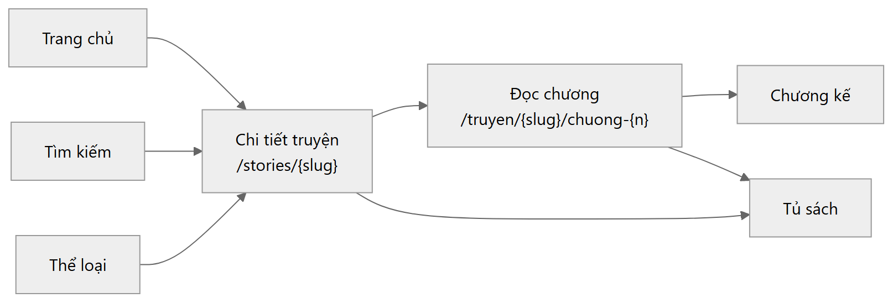
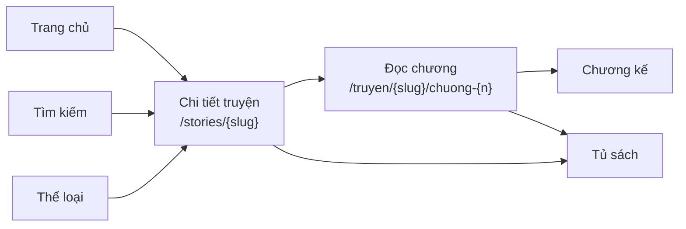
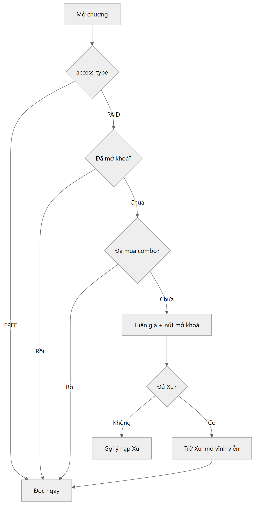
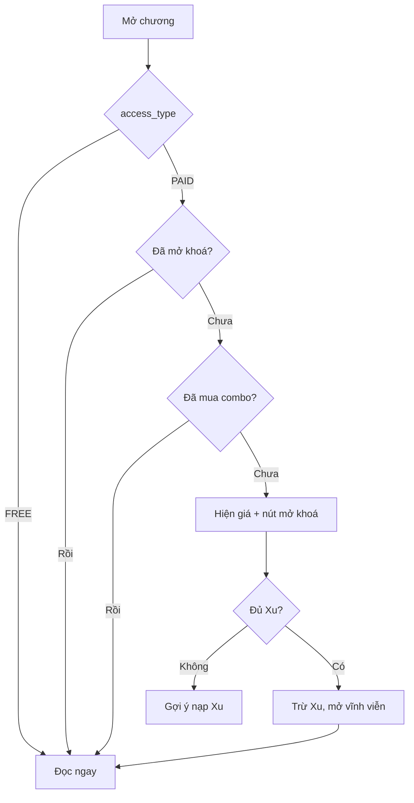

# Đọc truyện

## Đường đi của độc giả

Mã nguồn sơ đồ

---

## Trang đọc

- Đổi cỡ chữ, giãn dòng, nền sáng/tối
- Nhớ vị trí đọc (`reading_progress`)
- Chuyển chương trước/sau
- Bình luận dưới chương

### Lượt xem tính khi nào

Ghi sau khi độc giả **ở lại 3 giây**, không ghi lúc mở trang. Trước đây tính ngay khi
tải chương, nên một lần mở bị đếm hai lần, và cả prefetch lẫn bấm nhầm rồi thoát cũng
được tính.

### URL chương

`/truyen/{story-slug}/chuong-{số}` — số ở đây là `chapters.chapter_number`, đánh theo
**vị trí** trong truyện.

Với truyện nhập từ file có nhảy số chương, số trên URL sẽ lệch với số trong tiêu đề. Ví
dụ truyện 385 chương mà file thiếu chương 87: `/chuong-385` mở ra chương tên "Chương 386".
Link không gãy (danh sách chương dùng cùng con số đó) nhưng lệch một đơn vị từ chỗ thiếu
trở đi.

---

## Chương trả phí

Mã nguồn sơ đồ

Giá chương do nhóm đặt. Chương `PAID` mà giá 0 bị server từ chối — nó sẽ mở khoá miễn phí,
nên hai trường đó phải khớp nhau.

---

## Tủ sách và theo dõi

| Chức năng | Bảng | Ý nghĩa |
|---|---|---|
| Tủ sách | `library_items` | Lưu để đọc sau |
| Theo dõi | `story_follows` | Nhận thông báo chương mới |
| Tiến độ | `reading_progress` | Đang đọc đến đâu |

Ba thứ khác nhau và độc lập: có thể theo dõi mà không lưu tủ sách, và ngược lại.

---

## Truyện audio

`chapter_audios` gắn bản audio vào chương. `stories.content_type` là `TEXT`, `AUDIO` hoặc
`TEXT_AUDIO`. `audio_listens` ghi lượt nghe.

---

## Truyện ngắn Zhihu

`story_format = ONESHOT`. Khác truyện dài ở hai chỗ:

- Trang đọc **không hiện danh sách chương** — đọc một mạch
- Khi cắt file không có dòng phân chương, dùng ngân sách **1.400 từ** thay vì 800

---

## Bình luận

Có phân cấp (`parent_id`), có thả tim (`comment_likes`), có báo cáo vi phạm.

Xoá bình luận **giữ nguyên dòng** và đổi `status`. Một chuỗi trả lời bị thủng ở giữa thì
đọc như hỏng, và kiểm duyệt cần thấy nội dung đã nói gì.

---

## Chat cộng đồng

Phòng chat ở trang chủ và góc Zhihu (`community_rooms`, `community_messages`).

Khách **đọc được**, đăng thì cần tài khoản. Tên hiển thị lấy từ bảng `users` lúc đọc,
không lưu kèm tin nhắn — đổi tên thì tin cũ cũng đổi theo.

> Trước đây khung chat này là **đồ giả**: ba người dùng bịa được nhét vào localStorage,
> gắn nhãn "🟢 Trực tiếp", và tin nhắn gửi tới một route chưa từng tồn tại. Mỗi khách
> thấy một cuộc trò chuyện riêng chưa từng xảy ra. Nay nó chạy thật.
